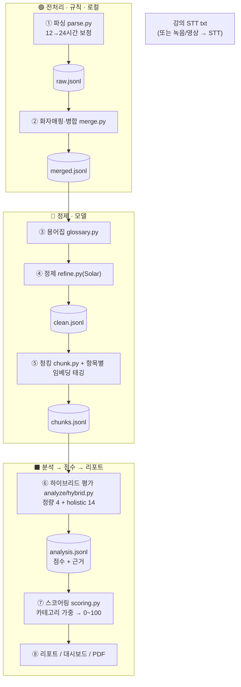

# 🎓 Lecture Analyzer — AI 강의 분석 리포트 생성기 (core)

> STT 강의 스크립트를 LLM으로 분석해 강사의 **강의력을 18개 항목으로 평가**하고, 근거·개선점을 리포트로 자동 생성하는 시스템.

**🌐 서비스: https://lectureanalzer.yeseulkim.cloud/** · 🎬 [시연 영상](https://www.youtube.com/watch?v=rOUDMiKr6xk) · 📊 성능평가: [`eval/`](https://github.com/2026-Lecture-Analyzer/eval)

NLP 과제 1 · 4인 1팀 · 4주 프로젝트. 본 저장소(**core**)는 분석 파이프라인 + 서비스(앱)·배포를 담습니다.

---

## 📌 개요

강의 STT 스크립트(또는 녹음/영상)를 입력받아, **강의 품질 체크리스트(5영역·18항목)** 기준으로 채점하고,
각 점수의 **근거 문장(타임스탬프 포함)** 과 **개선 우선순위**가 담긴 리포트를 웹 대시보드·PDF로 제공합니다.

- **입력**: 강의 스크립트(`.txt`) 또는 녹음/영상(자동 STT)
- **분석**: 정량 4항목(규칙 메트릭) + 나머지 14항목(holistic LLM, self-consistency)
- **출력**: 강의별 리포트 · 강사 코칭 · 수강생 피드백 비교 (대시보드 / PDF)

---

## ✨ 주요 기능

| 기능 | 설명 |
|---|---|
| 🎙️ 다양한 입력 | 텍스트 + 녹음/영상(Gemini STT 자동 전사) |
| 🧠 하이브리드 분석 | 정량 메트릭(결정적) + holistic LLM 채점, 점수와 근거 분리 생성(환각 방지) |
| 📊 분석 대시보드 | 종합 점수·레이더·주차 추이·오전/오후 비교·항목별 근거 |
| 🎯 강사 코칭 | 다회차 종합 + AI 코칭(진단·개선법·예시 멘트) |
| 📨 수강생 피드백 | 공개 설문(토큰 URL)으로 실제 수강생 평가 수집·집계 |
| 🆚 AI vs 학생 | AI 평가와 수강생 평가 항목별 비교 |
| 📄 리포트 출력 | 비개발자용 PDF 리포트(요약표·레이더·근거 인용) 원클릭 |
| 👥 멀티테넌트 | 구글 로그인·워크스페이스·초대, BYO 키(세션에만 보관) |

---

## 🚀 빠른 시작

```bash
# 1) 가상환경 (Python 3.13)
python3.13 -m venv .venv && source .venv/bin/activate
pip install -r requirements.txt

# 2) 서비스 실행 (로컬, 구글 OIDC 없이 개발 로그인)
LECTURE_DEV_USER=me@test.com .venv/bin/streamlit run service/app.py --server.port 8503
#   → http://localhost:8503

# 3) (선택) 전처리·EDA만
python -m scripts.run_preprocess     # txt → raw/merged.jsonl, speaker_map
python -m scripts.run_eda            # EDA 리포트
```

- 분석에는 사용자 **API 키**(Upstage Solar 또는 Google Gemini)가 필요합니다 — 화면에서 입력(세션에만 보관).
- 배포 서비스는 위 **🌐 서비스 URL**에서 바로 사용 가능합니다.

---

## 🏗️ 분석 파이프라인

원본 STT를 분석 가능한 형태로 가공 → 18항목 채점 → 리포트. **원칙: ① 규칙으로 끝낼 건 규칙으로(모델은 정제·분석에만) ② 원본 불변 + `raw_ref`로 타임스탬프까지 역추적 ③ 단계마다 manifest로 재현성.**



| 단계 | 방식 | 입력 → 출력 | 모듈 |
|---|---|---|---|
| ① 파싱 | 규칙 | txt → `raw.jsonl` | `preprocess/parse.py` |
| ② 화자매핑·병합 | 규칙 | raw → `merged.jsonl` | `preprocess/merge.py` |
| ③ 용어집 | 모델+검수 | merged → `glossary.json` | `refine/glossary.py` |
| ④ 정제 | 모델(Solar) | 섹션+용어집 → `clean.jsonl` | `refine/refine.py` |
| ⑤ 청킹·태깅 | 모델+임베딩 | clean → `chunks.jsonl` | `refine/chunk.py` |
| ⑥ 하이브리드 평가 | 규칙+LLM | chunks → `analysis.jsonl` | `analyze/hybrid.py` |
| ⑦ 스코어링 | 규칙 | analysis → `scores.json` | `scoring/scoring.py` |
| ⑧ 리포트 | 규칙 | scores → 대시보드/PDF | `report/`, `service/` |

**핵심 설계 메모**
- **점수와 근거 분리**: 점수는 holistic LLM(self-consistency 중앙값), 근거 문장은 항목별 임베딩 태깅 top-k로 별도 부착 → 환각 방지·항목 정합.
- **결정적 4항목**(반복·완결성·일관성·발화속도)은 규칙 메트릭으로 덮어써 안정성 확보.
- **재현성**: 패키지/모델 버전 고정, 산출물마다 manifest(깃 커밋·해시), 정제는 섹션 단위 체크포인트·재개.

> 단계 간 JSONL 인터페이스 계약: [docs/SCHEMA.md](docs/SCHEMA.md)

---

## 🖥️ 서비스 & 배포

- **앱**: `service/` — Streamlit 멀티테넌트(구글 로그인·워크스페이스·BYO 키·작업 큐·PDF 다운로드).
- **배포**: 소형 서버 1대 — `deploy/`(Docker Compose + Caddy 자동 TLS). AWS Lightsail 2GB / EC2 t4g.small 권장.

```bash
cd core && docker compose -f deploy/docker-compose.yml up -d --build
```

자세한 배포 가이드: [deploy/README.md](deploy/README.md)

---

## 📈 성능

사람 정답 14개 강의로 검증(2트랙):
- **점수 정확도**: 사람과 같은 방향 **91%** · 평균 오차 **0.67**(5점 만점)
- **근거 정확도**: 항목 근거 제시율 **94%** · 환각 없음

상세·재현: [`eval/`](https://github.com/2026-Lecture-Analyzer/eval) 저장소.

---

## 🗂️ 디렉터리 구조

```
core/
├── src/
│   ├── preprocess/     # 파싱·화자매핑·병합 (규칙)
│   ├── refine/         # 정제·청킹·항목별 임베딩 태깅 (Solar)
│   ├── analyze/        # 하이브리드 평가(holistic + 메트릭) · 18항목 프롬프트
│   ├── scoring/        # 카테고리 가중 → 종합 점수
│   ├── report/         # 리포트 빌드 · PDF(ReportLab) · 대시보드
│   ├── stt/ feedback/  # STT 전사 · 수강생 피드백
│   └── eda/            # EDA 통계·차트
├── service/            # Streamlit 멀티테넌트 SaaS (app·auth·workspace·jobs·report_view)
├── deploy/             # Docker · Caddy · 배포 가이드
├── scripts/            # 실행·스모크 테스트
├── notebooks/          # EDA · Colab 정제
├── docs/               # SCHEMA · TEAM · readme_drafts(팀원 초안 아카이브)
├── requirements.txt    # 로컬
└── requirements-colab.txt
```

> ⛔ 데이터·산출물(`outputs/`, `workspaces/`, `AI_Lecture_Analysis_Report_Generator/`, `reports/`)은 `.gitignore`로 제외.

---

## 🛠️ 기술 스택

| 구분 | 도구 |
|---|---|
| LLM | **Upstage Solar**(분석 기본) · **Google Gemini**(STT·옵션) |
| 임베딩 | API 임베딩(Upstage) / 로컬 모델 |
| 데이터 처리 | Python 3.13 · pandas · KoNLPy |
| 앱 / 시각화 | Streamlit · Plotly |
| 문서 생성 | ReportLab(PDF) |
| 배포 | Docker · Caddy(자동 TLS) · AWS |

---

## 👥 팀

NLP 과제 1 · 4인 1팀. 강의 품질 체크리스트(18항목)를 영역별로 분담 설계 — C2 강의 구조 · C3 개념 설명 · C4 진행 방식 · C5 실습·적용. 상세: [docs/TEAM.md](docs/TEAM.md)

---

## 🔒 데이터 보안 (필독)

제공 데이터는 실제 강의 스크립트를 포함하므로 반드시 준수합니다.

- 원본·정제·gold·분석 산출물 등 **데이터 일체 커밋/외부 공유 금지** (`.gitignore`로 차단)
- API 키는 `.env`/세션에만 보관, 커밋 금지
- 프로젝트 종료 후 제공 데이터 파기
- 🔒 특정 강사 실데이터(`reports/`)는 배포·커밋에서 제외(`.dockerignore`/`.gitignore`)

> 작업 전 `git status`에 데이터가 잡히지 않는지 확인하세요.
