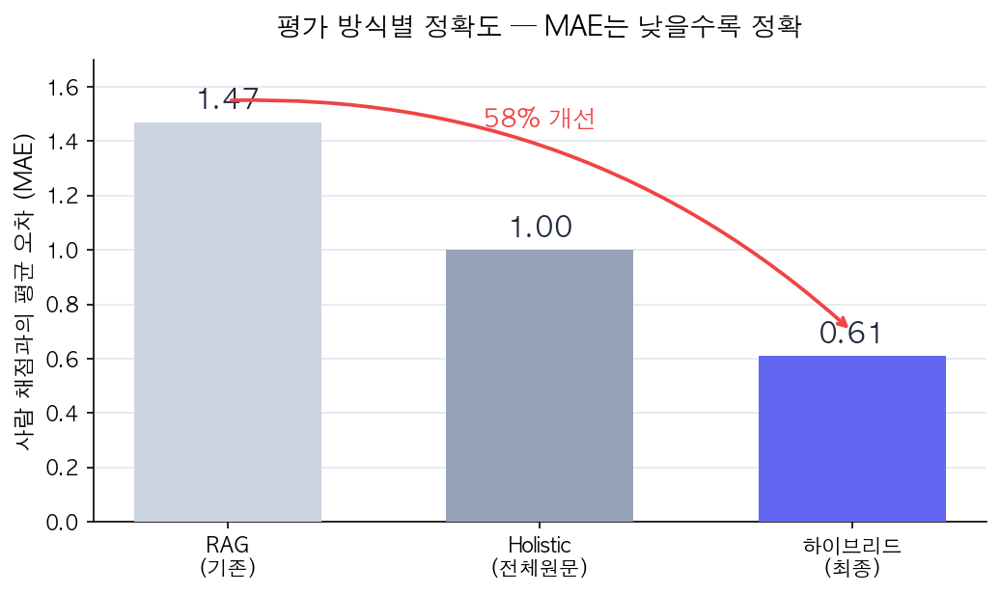
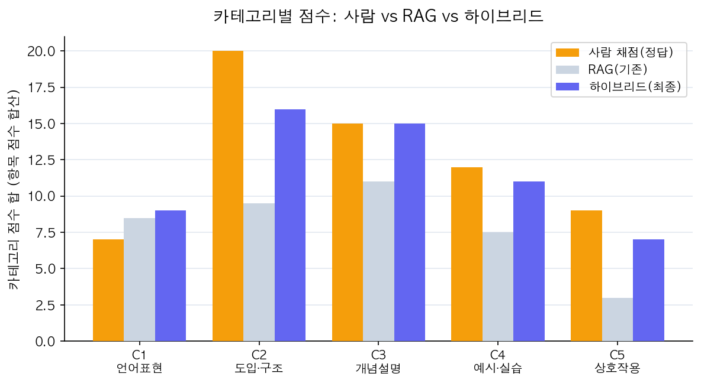

# LLM 기반 강의 품질 평가 파이프라인 고도화: RAG에서 스코프 인지 하이브리드까지 (사람 채점 대비 MAE 1.47 → 0.61)

강의 녹취(STT) 텍스트를 입력하면 18개 항목으로 강의 품질을 자동 채점하는 파이프라인을 개발하면서, 평가 정확도를 사람 채점 기준 MAE 1.47에서 0.61까지 끌어올린 과정을 정리합니다. 결론부터 말씀드리면, 핵심은 화려한 모델링 기법이 아니라 "각 평가 항목을 무엇으로, 어떤 버전의 데이터로 채점할 것인가"라는 설계 판단이었습니다.

---

## 1. 배경 — 강의 품질 자동 평가 시스템

이 시스템은 강의 음성을 STT로 받아쓴 텍스트를 입력받아, 5개 카테고리 18개 항목(개념 정의, 비유 활용, 이해 확인 질문, 발화 일관성 등)에 대해 1~5점으로 채점하고 근거까지 제시하는 것을 목표로 합니다. 쉽게 말해 AI 조교가 강의를 듣고 정해진 루브릭으로 채점하는 구조이며, 평가는 LLM과 일부 규칙 기반 지표가 함께 담당합니다.

## 2. 문제 진단 — RAG 방식의 구조적 한계

초기 구조는 전형적인 RAG(retrieval) 방식이었는데, 각 평가 항목을 쿼리로 삼아 임베딩 유사도가 높은 청크 top-5만 뽑아 LLM에게 보여주고 채점하게 했습니다. 그런데 결과 리포트를 보면 근거가 빈약한데도 만점이 나오거나, 강의에 분명히 존재하는 내용이 "전혀 없음 1점"으로 처리되는 경우가 잦아서, 평가 항목 하나가 강의 전체를 보지 못하고 일부만 보고 찍는 것이 아닌가 하는 의심이 들었습니다.

청크 산출물을 직접 분석해 보니 문제가 정량적으로 드러났습니다. 우선 전체 청크의 57%가 어떤 평가 항목에도 매칭되지 않아 평가에 아예 참여하지 못하고 있었고, 검색 유사도는 임계값(0.45)에 겨우 걸치거나 그보다 낮아서 관련 청크와 무관한 청크의 변별폭이 0.05 수준에 불과했습니다. 어떤 항목은 키워드가 본문에 분명히 있는데도 태깅 누락률이 90%를 넘었습니다.

원인은 명확했는데, 추상적인 루브릭 문장("핵심 개념을 명확히 정의하는가")과 구어체 강의 녹취는 표현 도메인이 너무 달라서 임베딩 코사인 유사도가 애초에 낮게 나올 수밖에 없었습니다. 그 낮은 신호로 top-5만 잘라내다 보니 각 항목이 강의의 약 10%만 보고 채점하고 있었고, 특히 "얼마나 자주 반복하는가"나 "전반적으로 일관적인가"처럼 강의 전체를 훑어야 하는 항목은 다섯 조각만으로는 제대로 판단할 수 없었습니다.

## 3. 설계 전환 — 전체 원문 기반 평가(Holistic)

RAG는 보통 원문이 너무 커서 한 번에 컨텍스트에 넣을 수 없을 때 사용하는 기법인데, 이 프로젝트에는 중요한 반전이 있었습니다. 파이프라인이 STT 원문을 정제(refine)해서 군더더기를 걷어낸 버전을 사용하는데, 정제 후에는 강의 하나가 6~8k 토큰밖에 되지 않아서 강의 전체가 프롬프트 한 번에 들어간다는 점이었습니다. 즉 굳이 RAG로 원문을 조각낼 이유 자체가 없었던 것입니다.

그래서 대조군으로 holistic 평가 방식을 만들었는데, 타임스탬프를 붙인 전체 전사와 18개 항목 루브릭을 한 프롬프트에 넣고 한 번의 호출로 18항목을 일괄 채점하는 방식입니다. 이렇게 하니 검색이 놓쳐서 "정의 없음 1점"을 주던 항목이 실제 근거를 인용하며 4점으로 바뀌었고, LLM 호출 수도 약 102건에서 6건으로 16분의 1까지 줄었습니다. 다만 "더 정확해 보인다"는 느낌만으로는 부족했기 때문에, 사람 채점과 직접 비교하는 검증이 반드시 필요했습니다.

## 4. 정량 검증 — 사람 채점과의 비교

다행히 한 강의는 사람이 18개 항목을 직접 채점한 리포트가 있어서, 이를 정답(gold)으로 두고 각 방식의 항목별 평균절대오차(MAE)를 측정했습니다. RAG는 MAE 1.86에 방향 일치율 33%로 사람보다 일관되게 박하게 채점한 반면, holistic은 MAE 1.00에 방향 일치율 83%로 사람 채점에 훨씬 근접했습니다. 특히 "강의 도입·구조" 카테고리는 RAG가 학습목표나 복습 발화를 검색에서 통째로 놓쳐 크게 어긋났지만, holistic은 사람과 거의 일치했습니다. 여기서 끝났다면 깔끔한 결론이었겠지만, 실제로는 한 가지 함정이 더 남아 있었습니다.

## 5. 핵심 발견 — 정제가 평가 신호를 제거하는 문제

holistic도 "언어 표현 품질(C1)" 카테고리에서는 계속 틀렸는데, 반복 표현·발화 완결성·존댓말 일관성처럼 사람은 "약함"이라고 본 항목을 holistic은 "좋음"이라고 높게 줬습니다. 원인을 추적하다가 결정적인 사실을 발견했는데, 평가하려는 결함(필러, 끊긴 문장, 반말 혼용) 자체를 정제(refine) 단계가 이미 모두 지워버렸다는 것이었습니다.

정제의 목적이 "군더더기 제거와 문어체 변환"이다 보니, 정제본을 읽으면 필러가 사라져서 "반복 없이 깔끔함"으로 보여 만점이 나오고, 반말이 존댓말로 정규화되어 "일관성 완벽"으로 보여 또 만점이 나오는 식이었습니다. 실제로 원문과 정제본의 존댓말 비율을 측정해 보니 각각 1.0과 0.53으로, 원문은 반말이 절반인데 정제본은 100% 존댓말이었습니다. 결국 C1은 정제본으로는 구조적으로 평가가 불가능한 카테고리였으며, LLM이 아무리 똑똑해도 입력에서 신호가 사라진 이상 방법이 없었습니다.

그래서 C1처럼 빈도와 일관성을 보는 항목은 LLM이 아니라 정제 전 원문(raw)에서 규칙으로 측정하도록 바꿨습니다. 존댓말 비율은 원문의 문장 종결어미로 계산하고, 반복은 원문 필러율에 더해 단일 표현이 전체의 1.5%를 넘으면 감점하는 "지배 필러" 신호를 추가했는데, 한 강의에서 특정 단어가 수백 번 등장하면 그것이 바로 사람이 체감하는 과도한 반복이기 때문입니다. 이 수정만으로 전체 MAE가 1.86에서 1.47로 떨어졌습니다.

## 6. 추가 개선 — 상호작용 항목의 동일 문제

리포트를 함께 검토하던 중 "이해 확인 질문 — 전혀 없음 1점"이라는 항목에 동료가 의문을 제기했고, 원문을 직접 읽어보라는 말에 raw 텍스트를 확인했습니다. 원문에는 "되셨어요?", "이해 가죠?", "해보세요", "같이 풀어볼까요"가 수십 번 등장했지만, 정제본에서는 이 표현들이 모두 0회로 사라져 있었습니다. "되셨어요"는 원문 20회에서 정제본 0회, "같이"는 18회에서 0회가 되는 식이었습니다.

이것 역시 C1과 정확히 같은 문제였는데, 이해 확인과 참여 유도 표현은 구어체이기 때문에 정제가 군더더기로 판단해 제거했고, holistic은 그 깨끗한 정제본만 읽으니 "상호작용 없음"으로 판정한 것이었습니다. 그래서 이해 확인과 참여 유도 항목도 원문에서 해당 표현의 빈도(10분당)를 측정하는 규칙으로 전환했고, 그 결과 두 항목 모두 사람 채점과 정확히 일치하면서 전체 MAE가 0.89에서 0.61까지 내려갔습니다.

아래 그래프는 세 방식의 사람 채점 대비 정확도를 비교한 것으로, 하이브리드가 기존 RAG 대비 약 58% 더 정확해졌음을 보여줍니다.

카테고리별로 보면 개선 지점이 더 분명한데, 하이브리드(파란색)가 사람 채점(주황색)을 거의 그대로 따라가는 반면, 기존 RAG(회색)는 도입·구조(C2), 예시·실습(C4), 상호작용(C5)에서 크게 미달하는 것을 확인할 수 있습니다.

## 7. 최종 설계 — 스코프 인지 하이브리드

결국 "한 가지 방법으로 18개 항목 전부"가 아니라, 항목의 성격(스코프)에 맞는 방법으로 분기하는 것이 정답이었습니다. 반복·일관성·이해확인 빈도·발화속도처럼 빈도와 일관성을 보는 항목은 정제본이 신호를 지우므로 원문 기반 규칙으로 측정하고, 개념 정의·비유·예시·실습 연계·도입 구조처럼 인스턴스와 구조를 보는 항목은 holistic으로 전체 원문을 읽혀 채점합니다.

구현은 holistic으로 18개 항목을 일단 채점한 뒤 빈도형 항목만 원문 규칙 점수로 덮어쓰는 방식이라, 출력 스키마가 기존과 동일해서 점수 집계·리포트·대시보드 코드를 그대로 재사용할 수 있었고, LLM 호출 수도 여전히 RAG의 16분의 1 수준을 유지했습니다.

## 8. 결론 및 배운 점

이번 작업에서 가장 크게 배운 것은 네 가지입니다. 첫째, RAG는 만능이 아니며 원문이 컨텍스트에 들어갈 만큼 작다면 굳이 조각내서 일부만 보여주는 것이 오히려 정확도를 떨어뜨리는 자해가 될 수 있으므로, "왜 RAG를 쓰는가"를 먼저 물어야 합니다. 둘째, 데이터를 깨끗하게 만드는 전처리가 하필 평가하려는 결함 그 자체를 제거할 수 있으므로, 무엇을 측정하려는지에 따라 어떤 버전의 데이터를 입력할지를 항목별로 다르게 가져가야 합니다. 셋째, 사람 채점과 비교하기 전에는 "더 좋아 보인다"를 믿어선 안 되는데, 실제로 holistic은 총점이 우연히 사람과 같게 나오기도 했지만 항목별로 뜯어보면 과대평가와 과소평가가 상쇄된 결과여서 총점만 봐서는 오류를 놓치게 됩니다. 넷째, 가장 큰 정확도 향상(MAE 0.89 → 0.61)은 정교한 기법이 아니라 동료가 원문을 직접 눈으로 읽고 "이거 있는데?"라고 짚어준 데서 나왔으며, LLM 평가 시스템에서도 원문을 직접 확인하는 것이 가장 강력한 디버깅이었습니다.

LLM 평가 파이프라인을 만들 때 프롬프트 작성에 매몰되기 쉽지만, 정작 중요한 것은 무엇을, 어떤 데이터로, 누구의 정답에 맞춰 평가하는가였습니다. 다음 단계에서는 남은 항목들과 다강의 일반화를 다뤄볼 예정입니다. 비슷한 LLM 평가 시스템을 고민하시는 분들께 도움이 되길 바랍니다.
