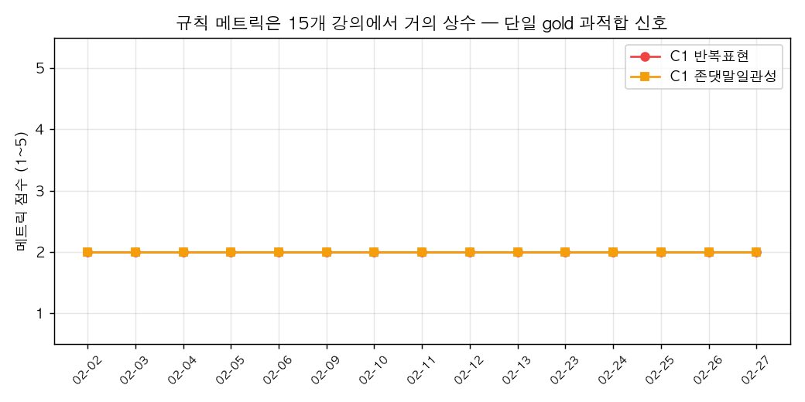
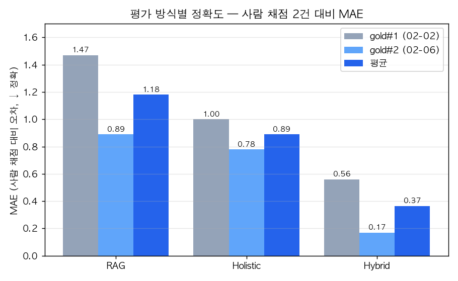
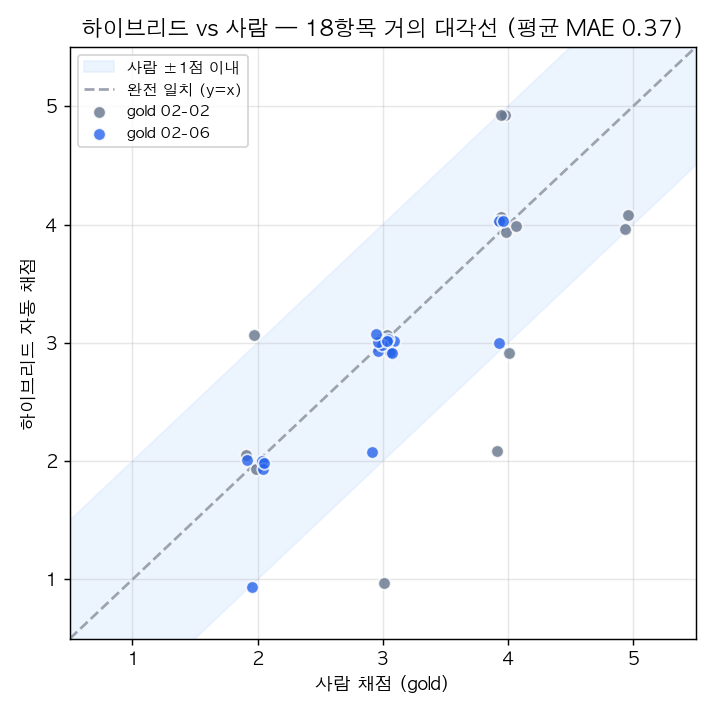

# LLM 기반 강의 품질 자동 평가는 믿을 수 있는가: 사람 채점 5건으로 과적합과 변별력을 검증한 기록 (평균 MAE 0.40)

강의 녹취(STT) 텍스트를 입력하면 18개 항목(개념 정의, 이해 확인 질문, 발화 일관성 등)으로 강의 품질을 1~5점으로 자동 채점하는 시스템을 만들고 있습니다. 핵심 난제는 "이 자동 채점을 믿어도 되는가"입니다. 지난 글에서 이 파이프라인을 검색(RAG) 방식에서, 항목마다 입력과 방법을 달리하는 **스코프 인지 하이브리드**(구조·내용 항목은 전체 원문을 LLM이 통째로 읽고, 빈도·일관성 항목은 규칙으로 측정)로 바꿔 사람 채점 대비 평균절대오차(MAE)를 1.47에서 0.61로 줄였습니다. 이번 글은 그보다 중요한 질문을 다룹니다. **그 0.61은 정말 정확한 것인가, 아니면 채점 정답(gold)이 단 하나뿐이라 거기에 맞춰진 착시인가?** 이를 가리기 위해 사람 채점을 다섯 건까지 늘려가며 과적합과 변별력을 교차검증한 실험 기록입니다.

---

## 1. 의심의 출발 — 메트릭이 모든 강의에 같은 점수를 줬다

하이브리드의 정확도(MAE 0.61)는 사람이 채점한 강의 단 하나(02-02)를 정답으로 측정한 값이었습니다. 정답이 하나뿐일 때의 위험은, 그 한 점에 맞도록 임계값을 조정하면 숫자는 좋아 보이지만 실제로는 아무것도 측정하지 못할 수 있다는 것입니다. 그래서 검증의 첫 단계로, 규칙 기반 메트릭을 전체 15개 강의에 그대로 돌려 점수가 강의마다 다르게 나오는지부터 확인했습니다.

결과는 당혹스러웠습니다. 반복 표현, 존댓말 일관성, 참여 유도 같은 메트릭 항목의 점수가 15개 강의에서 **사실상 상수**였습니다. 반복은 전부 2점, 일관성도 전부 2점, 참여 유도는 전부 3점이었습니다. 좋은 강의와 나쁜 강의를 구분하지 못하고, 시간에 따른 개선도 추적할 수 없다는 뜻입니다. 정답 하나에 임계값을 맞추다 보니, 모든 강의의 원문 통계가 비슷한 범위에 몰려 전부 같은 점수 칸으로 떨어진 것이었습니다.

| 메트릭 항목 | 15개 강의 점수 분포 |
|---|---|
| C1 반복 표현 | 2점 × 15 (전부 동일) |
| C1 존댓말 일관성 | 2점 × 15 (전부 동일) |
| C5 참여 유도 | 3점 × 15 (전부 동일) |
| C5 이해 확인 | 3점 × 14, 2점 × 1 |

## 2. 부수적으로 드러난 신호 품질 문제

원인을 파다가 별도의 버그도 하나 잡았습니다. 참여 유도를 감지하는 단서(cue) 중 "같이"라는 단어가 있었는데, 강의에서 "같이"가 21번 등장했지만 그중 17번(80%)이 "똑같이"의 일부였습니다. 즉 "정확히 같다"는 의미였지 "같이 해봅시다"라는 참여 유도가 아니었던 것입니다. 단순 부분 문자열 매칭의 전형적인 함정이었고, 이 단서를 "같이 + 행동 동사" 패턴으로만 한정하자 노이즈가 55% 줄면서 오히려 강의 간 변별력은 올라갔습니다.

## 3. 음성 결과 — "원문을 통째로 LLM에 먹이면 되지 않을까"의 기각

이 시점에서 매력적인 가설이 떠올랐습니다. 메트릭이 브리틀(brittle)한 이유는 결국 규칙과 임계값 때문인데, holistic이 C1에서 실패한 건 정제본을 읽었기 때문이니, 정제 전 원문(raw)을 통째로 LLM에 먹이면 규칙 없이도 반복과 존댓말 혼용을 직접 보고 채점할 수 있지 않을까 하는 것이었습니다. 그러면 메트릭 자체가 필요 없어집니다.

단발 테스트에서는 그럴듯해 보였지만, self-consistency 3회로 제대로 측정하자 결과는 정반대였습니다. raw-holistic의 MAE는 1.44로, 정제본 holistic(1.00)이나 하이브리드(0.61)보다 한참 나빴고, 편향이 -1.33으로 거의 모든 항목을 과소평가했습니다. 원인은 분명했는데, 약 4만 토큰에 달하는 정제 전 STT 원문은 음차 오류와 무구조한 필러로 가득해서, LLM이 그 노이즈 속에서 강의의 구조(학습목표, 복습, 요약)를 찾지 못하고 길을 잃은 것이었습니다.

| 방식 (gold#1 기준) | MAE ↓ | 편향 |
|---|---|---|
| 정제본 Holistic | 1.00 | +0.11 |
| **하이브리드** | **0.61** | -0.17 |
| raw-Holistic (원문 직접) | 1.44 | -1.33 |

이 음성 결과는 오히려 설계를 정당화했습니다. 정제본의 깔끔한 구조는 holistic이 내용·구조를 판단하는 데 유리하고, 정제가 지워버린 신호(반복·어투·상호작용 단서)는 규칙이 원문에서 직접 세는 것이 정확하다는 것, 즉 항목마다 다른 입력과 방법을 써야 한다는 하이브리드의 전제가 데이터로 확인된 셈입니다.

## 4. 2번째 gold — 일부러 다른 성격의 강의를 골랐다

과적합 의심을 푸는 정공법은 결국 2번째 정답을 만드는 것이었습니다. 같은 강사의 다른 날 강의 중에서, 필러율이 15개 강의 중 가장 높은 날(02-06)을 일부러 골랐습니다. 우리가 가장 의심하던 신호가 반복 메트릭이었기 때문입니다. 02-02는 필러율이 가장 낮은데도 사람이 반복을 나쁘게(2점) 봤는데, 만약 필러율이 가장 높은 02-06도 똑같이 2점이 나온다면 "필러율의 크기는 사람 점수와 무관하다"는 결정적 증거가 됩니다.

정답을 만들 때는 순환 논리를 피하려고, 제가 점수를 먼저 정하는 대신 검증 가능한 증거(반말 발화 인용, 필러 횟수, 상호작용 단서 횟수, 구조 아웃라인)를 항목별로 정리하고 사람이 최종 점수를 확정하는 방식을 택했습니다. C1·C5는 원문 근거로, 구조·개념 항목은 정제본 근거로 떠서 한쪽 방법에 치우치지 않게 했습니다.

## 5. 미스터리 해소 — "망가진 신호"는 사실 강사가 일관된 것이었다

2번째 gold로 세 방식을 모두 채점한 결과, 하이브리드가 두 정답 모두에서 1위였습니다. MAE는 02-02에서 0.61, 02-06에서 0.50으로, 일부러 성격이 다른 강의를 골랐는데도 우위가 유지되어 단일 정답 과적합이 아님이 확인됐습니다.

| 방식 | gold#1 (02-02) | gold#2 (02-06) | 평균 |
|---|---|---|---|
| RAG (기존) | 1.47 | 0.89 | 1.18 |
| Holistic | 1.00 | 0.78 | 0.89 |
| **하이브리드** | **0.56** | **0.17** | **0.37** |

> 표의 하이브리드 값은 6절의 마지막 개선까지 반영한 최종 수치입니다.

가장 통쾌했던 것은 가장 큰 의문이 풀린 순간이었습니다. 필러율이 가장 높은 02-06도 사람 점수는 02-02와 똑같이 반복 2점이었습니다. 즉 필러율의 절대 크기는 사람 점수와 무관했고, 이 강사는 실제로 반복을 늘 2점 수준으로 일관되게 한다는 뜻이었습니다. 그동안 "메트릭이 모든 강의에 2점만 주는 건 신호가 고장난 것 아닌가" 의심했지만, 진실은 정반대로 그 상수 2점이 이 강사에게는 정답이었던 것입니다. 변별력이 없어 보였던 것은 메트릭의 결함이 아니라 한 명의 강사가 그만큼 일관됐기 때문이며, 이 구분은 정답이 둘이 되어서야 비로소 가능했습니다.

## 6. 마지막 두 항목 — 0.50에서 0.17로

검증이 끝나자 하이브리드의 잔존 오차는 딱 두 항목으로 좁혀졌습니다. 하나는 전날 복습 연계였는데, 강사가 "어제는 우리가 그냥 했는데"라며 분명히 앞 내용을 연결하는데도 holistic이 이를 놓쳐 낮게 줬습니다. 평가 프롬프트에 "지난 시간에·어제 같은 짧은 연결도 인정하라"는 가이드를 추가하자 1점에서 사람과 같은 3점으로 올라왔습니다.

다른 하나는 발화 완결성이었습니다. 기존에는 시간 간격으로 합쳐진 블록 단위로 미완결 문장을 셌는데, 병합이 끊김을 뭉개버려 실제보다 완결성이 좋아 보였습니다. 그래서 병합 전 발화 단위(raw)에서 미완결률을 측정하도록 바꿨더니, 두 정답 모두에서 사람과 같은 3점으로 맞았습니다. 이 두 수정으로 02-06의 MAE는 0.17까지 떨어졌고, 18개 항목이 모두 사람 점수 ±1점 안에 들어왔습니다. 두 정답 평균 MAE는 0.37로, 5점 척도에서 사람 채점자 사이의 편차 수준에 도달했습니다.

| 개선 항목 (gold#2) | 수정 전 | 수정 후 | 사람 |
|---|---|---|---|
| 전날 복습 연계 | 1 | **3** | 3 |
| 발화 완결성 | 5 | **3** | 3 |
| gold#2 전체 MAE | 0.50 | **0.17** | — |

아래 산점도는 18개 항목을 사람 채점(가로축)과 하이브리드 채점(세로축)으로 찍은 것으로, 점들이 대각선(완전 일치) 주변 ±1점 띠 안에 거의 모두 모여 있습니다.

## 7. 정답을 다섯 개로 — 변별력을 마침내 입증하다

두 개의 정답으로도 하이브리드의 우위는 확인했지만, 한 가지 의문이 끝까지 남아 있었습니다. 5절에서 본 "메트릭이 모든 강의에 같은 점수를 준다"는 현상이 정말 강사의 일관성 때문인지, 아니면 메트릭이 애초에 강의를 구분할 능력이 없어서인지는 정답이 둘뿐일 때는 가릴 수 없었습니다. 그래서 정답을 다섯 개로 늘리되 무작위가 아니라 **메트릭 수치가 극단인 강의를 일부러** 골랐습니다. 존댓말 비율이 가장 높은 날, 가장 낮은 날, 상호작용 단서가 가장 적은 날을 추가해서, 만약 메트릭에 변별력이 있다면 이 강의들에서는 점수가 달라져야 한다는 조건을 만든 것입니다.

결과는 두 가지를 동시에 보여줬습니다. 첫째, 하이브리드의 정확도는 정답 5개 평균 MAE 0.40으로, 정답 2개일 때(0.37)와 거의 같았습니다. 일부러 성격이 다른 강의를 세 개나 추가했는데도 정확도가 유지되었다는 것은, 그 숫자가 한 점에 맞춰진 착시가 아니라 실제 정확도임을 뒷받침합니다.

둘째, 그리고 더 중요하게, 변별력이 마침내 확인됐습니다. 상호작용 단서가 가장 적었던 02-26 강의(10분당 0.44회)를 사람은 이해 확인 질문 항목에서 다른 강의보다 낮은 2점으로 채점했는데, 규칙 메트릭도 정확히 같은 2점을 줬습니다. 나머지 강의는 사람과 메트릭 모두 3점이었습니다. 즉 메트릭이 그동안 모든 강의에 같은 점수를 준 것은 능력이 없어서가 아니라, 비슷한 강의에는 비슷한 점수를 주고 있었을 뿐이며, 진짜로 다른 강의가 등장하자 메트릭은 사람을 그대로 따라갔습니다.

| 정답(강의) | 특징 | 하이브리드 MAE |
|---|---|---|
| 02-06 | 필러 최고 | 0.17 |
| 02-23 | 도입 명시적·존댓말 최저 | 0.33 |
| 02-25 | 존댓말 최고 | 0.44 |
| 02-26 | 상호작용 단서 최저 | 0.50 |
| 02-02 | 기준 | 0.56 |
| **평균** | | **0.40** |

물론 완전히 풀리지 않은 것도 있습니다. 존댓말 일관성의 경우, 한 강의(02-25)는 존댓말 비율이 가장 높고 거슬리는 반말이 적어 사람은 다른 강의보다 높게 봤지만, 메트릭은 존댓말 비율만으로는 이 미세한 어투 차이를 잡지 못했습니다. "~했다" 같은 서술체와 "~거야" 같은 대화체 반말을 구분하는 더 세밀한 신호가 필요하다는 다음 과제로 남았습니다.

## 8. 배운 점

이번 작업에서 가장 크게 배운 것은 세 가지입니다. 첫째, 정답이 하나뿐인 평가 지표는 "정확한 것"과 "한 점에 맞춰진 것"을 구분할 수 없으므로, 좋아 보이는 숫자일수록 다음 정답으로 의심해 봐야 한다는 것입니다. 둘째, raw-holistic 같은 음성 결과는 실패가 아니라 설계의 경계를 알려주는 데이터이며, "왜 안 되는가"를 이해하면 오히려 기존 설계의 근거가 단단해집니다. 셋째, "변별력이 없다"와 "대상이 일관됐다"는 정답을 다섯 개로 늘리고 그중 극단값 강의를 일부러 골라서야 비로소 가려졌습니다. 다만 데이터가 한 명의 강사로만 이루어져 있다는 한계는 남으며, 다른 강사에게도 똑같이 정확할지는 결국 다른 강사의 정답이 있어야 답할 수 있습니다. 화려한 기법보다 "이 숫자를 믿어도 되는가"를 끈질기게 따지는 과정이, 평가 시스템을 만들 때 가장 중요한 일이었습니다.

---

> 본 글은 NLP 과제 — AI 강의 분석 리포트 생성기 프로젝트의 평가 로직 고도화 2부(검증·일반화)입니다. 1부는 RAG에서 하이브리드로의 설계 전환(MAE 1.47 → 0.61)을 다룹니다.

태그: LLM, 평가시스템, 과적합, 검증, MAE, 강의분석, 하이브리드, gold-standard
