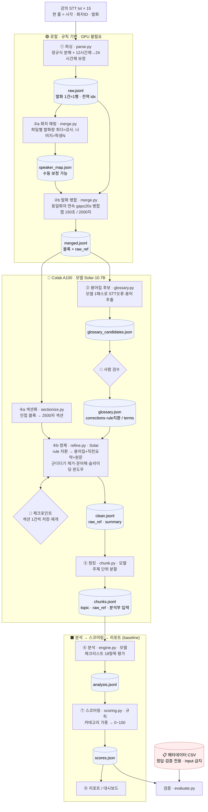
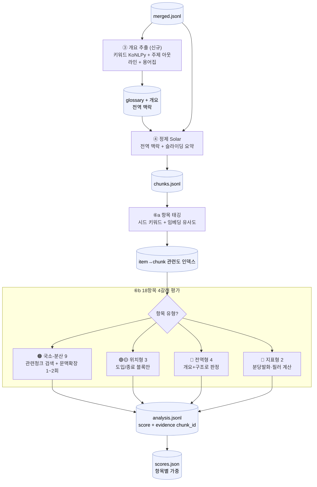
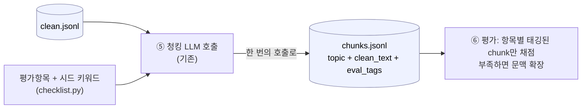

# 🎓 Lecture Analyzer — AI 강의 분석 리포트 생성기

> STT로 추출한 강의 스크립트를 LLM으로 분석해, 강사의 **강의력을 다각도로 평가**하고 개선 인사이트를 담은 리포트를 자동 생성하는 시스템

NLP 과제 1 · AI 엔지니어 자연어처리과정 · 4인 1팀 · 4주 프로젝트

---

## 📌 프로젝트 개요

강의 STT 스크립트를 입력받아, 내부 **강의 품질 평가 체크리스트(5개 카테고리 · 18개 항목)** 를 기준으로
LLM 프롬프트 분석을 수행하고 강의력 스코어와 개선 코칭이 담긴 리포트를 출력합니다.

- **입력**: 강의 스크립트(`.txt`), 강의 메타데이터(`.csv`)
- **분석 엔진**: 체크리스트 항목별 LLM 프롬프트 → 항목 점수 + 근거 추출
- **출력**: 강의별 분석 리포트 + 강사별 비교 + 주차별 추이 (대시보드 / PDF)

---

## ✨ 주요 기능

| 기능 | 설명 |
|---|---|
| 텍스트 전처리 | STT 스크립트 정제, 발화 단위 분할, 메타데이터 매핑 |
| 항목별 LLM 분석 | 체크리스트 18개 항목을 프롬프트화하여 자동 평가 |
| 강의력 스코어링 | 카테고리별 가중 점수 → 종합 강의력 스코어 산출 |
| 강사 비교 분석 | 강사·과목별 강의력 비교 |
| 시계열 추이 | 주차별 강의력 변화 추이 시각화 |
| 리포트 생성 | 비개발자도 이해 가능한 리포트 자동 출력(PDF/DOCX/대시보드) |

---

## 🗂️ 디렉터리 구조

```
lecture-analyzer/
├── README.md                              # (현재 파일) 프로젝트 문서
├── .gitignore                             # 데이터·키·아티팩트 제외 설정
├── .env.example                           # 환경 변수 템플릿 (키 값은 비움)
├── src/                                   # 분석 파이프라인 소스
│   ├── config.py                          #   경로·상수·병합/모델 파라미터·JVM 설정
│   ├── manifest.py                        #   재현성 manifest(깃·버전·해시·설정)
│   ├── preprocess/                        #   전처리 (Step 0~2, 규칙·GPU 불필요)
│   │   ├── parse.py                       #     Step1: txt → raw.jsonl
│   │   ├── merge.py                       #     Step2: 화자매핑+발화병합 → merged.jsonl
│   │   ├── loader.py                      #     (EDA용) STT → DataFrame
│   │   └── text.py                        #     (EDA용) 토큰화·필러 분석(KoNLPy)
│   ├── refine/                            #   정제 (Step 3~5, 모델·Colab) — P1
│   │   ├── sectionize.py                  #     블록 → 큰 섹션(맥락 보존)
│   │   ├── glossary.py                    #     Step3: 용어집(규칙치환+모델후보)
│   │   ├── refine.py                      #     Step4: Solar 정제(체크포인트/재개)
│   │   ├── chunk.py                       #     Step5: 주제 단위 청킹
│   │   ├── prompts.py / jsonout.py        #     프롬프트 / 모델출력 JSON 파싱
│   │   └── model.py                       #     Solar-10.7B 로더/generate_fn
│   ├── analyze/                           #   분석 엔진 (P2) — 체크리스트 18항목 LLM 평가
│   │   ├── checklist.py                   #     18항목 정의(진실원천)
│   │   ├── prompts.py / engine.py         #     항목 프롬프트 / chunks→analysis.jsonl
│   ├── scoring/                           #   스코어링·검증 (P3)
│   │   ├── scoring.py                     #     카테고리 가중→종합점수
│   │   └── evaluate.py                    #     메타데이터(정답) 기반 검증
│   ├── report/                            #   리포트·대시보드 (P4)
│   │   ├── build.py                       #     강의별 리포트(MD→PDF/DOCX)
│   │   └── dashboard.py                   #     Streamlit 대시보드 스텁
│   └── eda/report.py                      #   EDA 통계·차트·리포트 엔진
├── scripts/
│   ├── run_preprocess.py                  # Step 0~2 실행(로컬, GPU 불필요)
│   ├── run_eda.py                         # EDA 리포트 실행
│   └── smoke_refine.py                    # Step 3~5 배관 스모크 테스트(모델 stub)
├── notebooks/
│   ├── 01_eda.ipynb                       # 인터랙티브 EDA
│   └── 02_refine_colab.ipynb             # Colab(A100): Step 3~5 정제 파이프라인
├── requirements.txt                       # 로컬(전처리·EDA) — 버전 고정
├── requirements-colab.txt                 # Colab(모델 추론) — 버전 고정
├── outputs/                               # ⛔ 산출물 (git 미포함)
│   ├── eda/                               #   eda_report.md + figures/
│   └── processed/                         #   raw/merged.jsonl, speaker_map, manifest
└── AI_Lecture_Analysis_Report_Generator/  # ⛔ 제공 데이터 (git 미포함, 로컬 전용)
```

> ⚠️ `AI_Lecture_Analysis_Report_Generator/` 는 제공 데이터·기본 README·체크리스트를 담고 있으며
> **`.gitignore`에 의해 저장소에 포함되지 않습니다.** 로컬에서만 사용하세요.

---

## 🚀 시작하기

```bash
# 1. 가상환경 (Python 3.13 권장 — 3.14 alpha는 패키지 호환 이슈)
python3.13 -m venv .venv && source .venv/bin/activate

# 2. 의존성 설치
pip install -r requirements.txt

# 3. 환경 변수 설정 (.env.example 복사 후 키 입력)
cp .env.example .env   # OPENAI_API_KEY / ANTHROPIC_API_KEY

# 4. EDA 리포트 생성
python -m scripts.run_eda
#   → outputs/eda/eda_report.md + figures/*.png 생성
```

> 제공 데이터는 저장소에 포함되지 않으므로, 로컬 `AI_Lecture_Analysis_Report_Generator/` 폴더에
> 원본 데이터를 직접 배치한 뒤 실행하세요.

### KoNLPy(형태소 분석) 주의

KoNLPy는 **Java(JDK)** 가 필요합니다. JPype 최신 버전과 JDK 조합에서 JVM 경로 탐지 버그가 있어,
[src/config.py](src/config.py)의 `resolve_jvm_path()`가 `JAVA_HOME` 또는 `/usr/libexec/java_home`에서
경로를 직접 찾아 넘깁니다. Java가 없으면 EDA의 키워드/필러 분석만 건너뛰고 나머지는 정상 생성됩니다.

### 📊 EDA 주요 발견

- **STT 타임스탬프는 12시간제(AM/PM 미표기)** → 01~05시를 13~17시로 보정 처리.
- **메타데이터 과목명과 실제 강의 내용이 불일치** — 메타는 HTML/React/HTTP인데
  실제 발화는 Java IO·SQL/DB(테이블·조인·인덱스). `subject`를 정답 라벨로 신뢰 불가.
- 음성 인식 오류 다수(예: '잡바'=Java) → 도메인 용어 정규화 사전 필요.
- 자세한 내용은 `outputs/eda/eda_report.md`(로컬 생성) 참고.

---

## 🔧 전처리·정제 파이프라인

원본 STT를 LLM 분석에 쓸 수 있는 형태로 가공한다. **원칙 2가지: ① 모델은 Step 3~5에만(1~2는 규칙)
② 원본 불변 + `raw_ref`로 타임스탬프까지 추적.**



| 단계 | 방식 | 입력 → 출력 | 실행 위치 |
|---|---|---|---|
| ① 파싱 | 규칙 | txt → `raw.jsonl` | 로컬 |
| ②a 화자 매핑 | 규칙 | raw → `speaker_map.json` | 로컬 |
| ②b 발화 병합 | 규칙 | raw(+맵) → `merged.jsonl` | 로컬 |
| ③ 용어집 | 모델 | merged → `glossary_candidates.json` → 검수 → `glossary.json` | Colab |
| ④a 섹션화 | 규칙 | merged → 섹션(메모리) | Colab |
| ④b 정제 | 모델(Solar) | 섹션+용어집 → `clean.jsonl` | Colab |
| ⑤ 청킹 | 모델 | clean → `chunks.jsonl` | Colab |
| ⑥ 분석 | 모델 | chunks → `analysis.jsonl` | Colab |
| ⑦ 스코어링 | 규칙 | analysis(+정답) → `scores.json` | 로컬 |
| ⑧ 리포트 | 규칙 | scores → 리포트/대시보드 | 로컬 |

### 단계별 상세 (모든 TODO 구현 = baseline 기준)

> 관통 원칙: **① 모델은 ③~⑥에만(규칙으로 끝낼 건 규칙으로) ② 원본 불변 + `raw_ref`로 발화·타임스탬프까지 역추적 ③ 단계마다 manifest로 재현성**.

**① 파싱 (규칙 · 로컬)** — `src/preprocess/parse.py`
- 입력: `강의 스크립트/*.txt` 15개. 한 줄 = `<HH:MM:SS> 화자ID: 발화`.
- 처리: 정규식으로 `{시각, 화자ID, 발화}` 분해. STT는 **12시간제(AM/PM 미표기)** → `01~06시를 13~18시로 보정`(`to_24h`). 정형 이탈 줄은 버리지 않고 `malformed=True`로 보존.
- 출력: `raw.jsonl` — 발화 1건=1행, 전역 `idx`, `sec_of_day`(병합용), `session`(오전/오후).
- 추적성: 모든 후속 산출물이 이 `idx`를 `raw_ref`로 참조.

**②a 화자 매핑 (규칙 · 로컬)** — `src/preprocess/merge.py`
- 해시 화자ID가 **세션마다 바뀌므로 파일(일자) 단위**로 집계. 발화량 최다=`강사`, 나머지=`학생N`.
- 출력: `speaker_map.json` `{파일: {화자ID: 역할}}` — **사람이 수동 보정 가능**(보조강사/학생 오판 시).

**②b 발화 병합 (규칙 · 로컬)** — `src/preprocess/merge.py`
- 같은 화자의 연속 발화를 **시간 간격 `gap≤20초`** 기준으로 한 블록으로 병합 → "한 문장이 여러 타임스탬프로 쪼개진" 문제 해결.
- 근거: 측정 결과 동일화자 연속 gap 중앙값 10초·81%가 ≤15초 → 원안 2~3초는 과분할이라 **20초로 상향**. 폭주 방지 캡(`150초`/`2000자`).
- 출력: `merged.jsonl` — 블록 `{start/end_time, speaker_role, text, raw_ref[]}`. 22,756 발화 → 약 2,436 블록.

**③ 용어집 (모델 1패스 + 사람 검수 · Colab)** — `src/refine/glossary.py`
- 본 정제 전에 전사를 싸게 1패스 훑어 **STT 오류 후보(`잡바→Java`)·핵심 용어**를 모아 `glossary_candidates.json` 생성.
- **사람이 검수** → `glossary.json` 확정. `corrections` 중 `rule:true`는 ④에서 모델 호출 **전에 결정적 치환**(일관성↑·모델부담↓), 나머지는 모델이 문맥으로 처리.
- 같은 강의 시리즈면 재사용. `SEED_GLOSSARY`(EDA 확인 오류)가 시작점.

**④a 섹션화 (규칙 · Colab)** — `src/refine/sectionize.py`
- 정제는 문장 단위❌ **큰 섹션 단위**(맥락 보존). 같은 파일·세션 내 인접 블록을 `2500자` 한도로 누적해 섹션 구성. `block_ids`/`raw_ref` 유지.

**④b 정제 (모델 Solar-10.7B · Colab)** — `src/refine/refine.py`
- 입력 프롬프트 = `rule 치환 적용 원문` + `[확정 용어집] + [직전 섹션 요약] + [이번 섹션 원문]`.
- 처리: 군더더기/간투사 제거 + 문어체 정리 + 용어 보정. **슬라이딩 윈도우**(직전 섹션 1~2문장 요약을 다음 섹션 맥락으로 전달, 출력은 이번 섹션만 → 중복 방지).
- **체크포인트**: 섹션 1건 정제할 때마다 `clean.jsonl`에 즉시 append+flush. Colab 끊겨도 **이미 처리한 `section_id`는 건너뛰고 재개**(Drive에 두면 영속).
- 출력: `clean.jsonl` `{section_id, clean_text, summary, raw_ref}` — 정제본이 원본 발화 범위(`raw_ref`)를 그대로 참조해 타임스탬프 추적 유지.

**⑤ 청킹 (모델 · Colab)** — `src/refine/chunk.py`
- 정제 텍스트를 **주제(소단원) 단위로 재분할**("복습→오늘 주제" 전환점). 각 청크에 `topic` 라벨.
- 출력: `chunks.jsonl` `{chunk_id, topic, clean_text, raw_ref, time_range}` — **분석부(⑥)의 입력**.
- v1 한계: 청크별 `raw_ref`는 부모 섹션 것을 상속(정밀 정렬은 향후 과제).

**⑥ 분석 (모델 · Colab)** — `src/analyze/engine.py` *(P2 TODO)*
- 강의(=`date_session`) 단위로 체크리스트 **18항목**을 LLM 평가 → 항목별 `{score 1~5, verdict, evidence[{chunk_id, quote}], comment}`. 체크포인트/재개.
- 출력: `analysis.jsonl`(항목 1건=1행).

**⑦ 스코어링 (규칙 · 로컬)** — `src/scoring/scoring.py` *(P3 TODO)*
- 카테고리별 평균 → 가중합 → **0~100 종합 강의력 점수**. 강사/세션 비교, 주차 추이.
- 출력: `scores.json`. + `evaluate.py`가 **메타데이터(정답)** 로 커버리지·정확도 검증(⚠️ 메타는 검증 전용, input 금지).

**⑧ 리포트/대시보드 (규칙 · 로컬)** — `src/report/` *(P4 TODO)*
- 강의별 리포트(MD→PDF/DOCX) + Streamlit 대시보드(점수·근거 인용 드릴다운).

> **baseline의 알려진 한계(검토 포인트)**: 청크 `raw_ref` 정밀 정렬 부재 · 용어집 수동 검수 의존 · 항목별 토큰 초과 시 청크 선별(임베딩) 미적용 · 점수 가중치 미확정 · 정제 품질 정량 지표 부재. → 여기에 더할 것 검토.

### 로컬: Step 0~2 (GPU 불필요)

```bash
python -m scripts.run_preprocess     # raw.jsonl, merged.jsonl, speaker_map.json, manifest
python -m scripts.smoke_refine       # (선택) Step 3~5 배관 점검 — 모델 없이 stub로
```

### Colab: Step 3~5 (A100 · Solar-10.7B)

1. 로컬 산출물 `outputs/processed/merged.jsonl` 을 Google Drive `MyDrive/lecture-analyzer/` 에 업로드
2. [notebooks/02_refine_colab.ipynb](notebooks/02_refine_colab.ipynb) 를 Colab에서 열고 런타임 **A100**로 설정 후 순서대로 실행
3. 산출물(`clean.jsonl`, `chunks.jsonl`)은 Drive에 **1건씩 체크포인트** 저장 — 런타임이 끊겨도 해당 셀만 재실행하면 이어서 재개

> 코드는 repo에서, **데이터는 Drive에서**(분리). 데이터·정제 산출물은 git/공개 업로드 금지.

### 설계 메모

- **화자 매핑은 파일(일자)별** — 해시 ID가 세션마다 바뀜. `speaker_map.json`은 수동 보정 가능.
- **병합 임계값 20초** — 측정 결과 동일화자 연속 gap 중앙값 10초, 81%가 ≤15초. 원안의 2~3초는 과분할이라 상향([src/config.py](src/config.py)에서 조정).
- **용어집 2종** — `rule:true` 항목은 모델 호출 전 결정적 치환, 나머지는 모델이 처리.
- **재현성** — 패키지/모델 버전 고정([requirements.txt](requirements.txt), [requirements-colab.txt](requirements-colab.txt)), 모델 `revision` 핀 권장(config), 그리디 디코딩+시드 고정, 산출물마다 `manifest`(깃 커밋·버전·입력 해시) 동봉.
- **모델 주입(`generate_fn`)** — 파이프라인 로직과 모델을 분리해, GPU 없이도 `smoke_refine.py`로 배관 검증.

---

## 📐 분석 → 스코어링 → 리포트 (다음 단계)

`chunks.jsonl` 이후 단계. 단계 간 인터페이스는 **[docs/SCHEMA.md](docs/SCHEMA.md)** 의 JSONL 계약을 따른다.

| 단계 | 모듈 | 입력 → 출력 |
|---|---|---|
| 분석(18항목) | `src/analyze/` | `chunks.jsonl` → `analysis.jsonl` |
| 스코어링·검증 | `src/scoring/` | `analysis.jsonl` + 메타(정답) → `scores.json` |
| 리포트·대시보드 | `src/report/` | `scores.json` → 강의별 리포트 / Streamlit |

> ⚠️ **메타데이터는 정답/검증 전용** — 분석 input(모델 프롬프트)에 넣지 않는다.

**4인 역할 분담**: [docs/TEAM.md](docs/TEAM.md) (P1 정제 / P2 분석 / P3 스코어링·검증 / P4 리포트·인프라).

---

## 🛠️ 기술 스택

| 구분 | 도구 |
|---|---|
| LLM | OpenAI GPT-4o / Claude API |
| NLP 프레임워크 | LangChain / LlamaIndex |
| 데이터 처리 | Python (pandas, KoNLPy) |
| 시각화 / 대시보드 | Streamlit / Gradio |
| 문서 생성 | ReportLab / python-docx |

---

## 👥 팀 · 역할 분담

> 규칙 기반 전처리(Step 0~2)는 완료·검증됨. 아래는 **고도화 단계** 분담.
> 단계 간 인터페이스(JSONL 계약)는 **[docs/SCHEMA.md](docs/SCHEMA.md)** — 이것만 지키면 4명이 병렬로 진행.

| 역할 | 워크스트림 | 실행 | 담당 폴더 | 입력 → 산출물 | 이름 |
|---|---|---|---|---|---|
| **P1** | 정제 고도화 | 🔴 Colab(Solar) | `src/refine/` | `merged.jsonl` → `clean.jsonl`, `chunks.jsonl` | (작성 예정) |
| **P2** | 분석 엔진 | 🔴 Colab(LLM) | `src/analyze/` | `chunks.jsonl` → `analysis.jsonl` | (작성 예정) |
| **P3** | 스코어링·검증 | 🟢 로컬 | `src/scoring/` | `analysis.jsonl` + 메타(정답) → `scores.json` | (작성 예정) |
| **P4** | 리포트·대시보드·인프라 | 🟢 로컬 | `src/report/` | `scores.json` → 리포트/대시보드 | (작성 예정) |

**P1 — 정제 고도화 (Colab)**
- Colab에서 Solar-10.7B 실제 구동, 정제 프롬프트 튜닝(군더더기 제거 품질)
- 용어집 후보 추출→검수→`glossary.json` 확정, `rule:true` 항목 정리
- 청킹 고도화: LLM 분할 → 임베딩(sentence-transformers) 기반 주제경계 검토
- 정제 전/후 품질 지표(필러 감소율 등) 측정

**P2 — 분석 엔진 (Colab)**
- 체크리스트 18항목(`src/analyze/checklist.py`)별 프롬프트 정교화 + few-shot
- 강의별 항목 평가 → `analysis.jsonl`(근거 인용 `chunk_id` 포함)
- 토큰 초과 대비: 항목별 관련 청크 선별(임베딩 검색), self-consistency 옵션
- ⚠️ 실제 체크리스트 PDF의 세부 기준을 `checklist.py` description에 반영

**P3 — 스코어링·검증 (로컬)**
- `scoring.py`: 카테고리 가중→종합점수, `CATEGORY_WEIGHTS` 확정
- 강사/세션 비교, 주차별 시계열 추이
- `evaluate.py`: **메타데이터를 정답으로** 분석 정확도 검증 (⚠️ 메타는 input 금지, 검증 전용)

**P4 — 리포트·대시보드·인프라 (로컬)**
- `build.py`: 강의별 리포트(MD→PDF/DOCX), `dashboard.py`: Streamlit 대시보드
- 재현성/CI: manifest, 버전 핀, repo 브랜치·PR 운영, 발표자료/시연영상

**중간점검(2주차) 정렬**: 단일 강의 1편 end-to-end — P1 정제 → P2 18항목 분석 → P3 점수 1건 → P4 리포트/시연.

> 각 모듈에 `TODO(P#)` 주석으로 다음 작업 표시. 전체 상세: [docs/TEAM.md](docs/TEAM.md)

---

## 🔒 데이터 보안 (필독)

제공 데이터는 **실제 강의 스크립트**를 포함하므로 아래를 반드시 준수합니다.

- 프로젝트 목적 외 사용 및 외부 공유 **금지**
- 개인 클라우드 · SNS 등 외부 업로드 **금지**
- **원본 데이터 GitHub 커밋 금지** → `.gitignore`로 `AI_Lecture_Analysis_Report_Generator/` 전체 제외 처리됨
- API 키는 `.env`에만 보관하며 커밋하지 않음
- 프로젝트 종료 후 모든 제공 데이터 **파기** 및 파기 확인서 제출

> 작업 전, 원본 데이터가 `git status`에 잡히지 않는지 반드시 확인하세요.

---
---

# 💡 KYS 설계 제안 — 전처리 보강 + 평가 라우팅

> 이 아래는 **김예슬(KYS) 개인 제안 영역**. 팀원들이 각자 아이디어를 내는 중이라 본 README와 분리해서 정리한다.
> 핵심은 "**왜 이렇게 가려 하는가**"를 끝까지 보이게 하는 것.

## 0. TL;DR (한 장 요약)

1. **메타데이터는 input이 아니다**(실서비스엔 스크립트만 들어옴) → 강의의 **주제·키워드·요약을 스크립트에서 직접 추출**하는 단계를 전처리에 넣는다.
2. **루브릭 18항목 평가는 LLM 필수**지만, 통째로 넣으면 토큰 폭발 + needle-in-haystack 정확도 저하 → **항목별로 관련 근거만 검색해서** 평가한다.
3. 18항목은 성격이 달라서 **한 방식으로 못 민다** → **4갈래(지표/도입·종료/검색/전역)로 라우팅**. (PDF 세부기준으로 확정)

---

## 1. 출발점 — 설계는 "두 제약"에서 나온다

### 제약 A. 메타데이터는 정답일 뿐, 입력이 아니다
- `강의 메타데이터.csv`(과목·강사·내용)는 **평가/검증용 정답**. 실제 서비스에서 강사가 분석 맡길 땐 **STT 스크립트 하나만** 들어온다.
- 게다가 EDA에서 확인했듯 **메타 subject ≠ 실제 내용**(메타=React/HTTP, 실제=Java/SQL). 메타를 input에 쓰면 누설이자 왜곡.
- **결론**: "이 강의가 무엇에 대한 것인가(주제·키워드)"를 **메타가 아니라 스크립트에서 직접 뽑아야** 한다. → 전처리에 **개요 추출** 단계가 필요한 근본 이유.

### 제약 B. 루브릭 평가엔 LLM이 필수지만, 무작정 넣으면 안 된다
- 18항목은 "비유를 적절히 들었는가" 같은 **정성 판단** → 규칙으론 불가, **LLM 필수**.
- 그런데 강의 1편이 20만 자. 18항목마다 전체를 LLM에 넣으면:
  - **토큰 비용 폭발** (18 × 전체 × 강의수)
  - **needle-in-haystack**: 긴 맥락에서 한 근거를 찾는 정확도가 떨어짐(LLM 약점)
- **결론**: 항목마다 **관련 있는 부분만 골라** 넣어야 한다. → "블록 태깅 → 검색 → 부족하면 문맥 확장" 설계의 근본 이유.

> 즉 **전처리의 개요 추출**과 **평가의 항목별 검색**은 서로 다른 문제가 아니라, **"스크립트만으로 자급자족"** 이라는 같은 원칙의 두 얼굴이다.

---

## 2. 전처리 보강 — 개요(키워드·주제·요약) 추출

### 왜 필요한가
구어체 정제(④)에서 **도메인 맥락이 없으면 STT 오류 복원이 망가진다.** 예: "조인"을 모델이 일상어로 잘못 고치거나, "셀렉→select" 판단을 못 함. 지금 정제는 `용어집 + 직전 섹션 요약(로컬)`뿐, **전역 주제가 없다.** 개요가 이 빈틈을 채운다.

### 어디에 넣나
`② merged` 다음, `④ 정제` 전. 기존 `③ 용어집` 단계와 **묶어서** 한 번의 스킴으로 처리(별도 패스 추가 안 함).

### "요약"은 두 개로 쪼갠다 (중요)
| | 가이드 요약 | 최종 요약 |
|---|---|---|
| 위치 | 정제 **전** | 정제/청킹 **후** |
| 품질 | 거칠어도 됨(맥락 힌트) | 깔끔해야 함(리포트용) |
| 입력 | raw(지저분) | clean(정제됨) |
- 정제 전 요약을 raw에서 뽑으면 garbage-in 위험 → "주제 한 줄 + 키워드"의 **거친 가이드**면 충분.

### 비용 설계 (점진 도입)
1. **키워드는 KoNLPy 명사빈도(무료·길이무관)** 로 먼저 — EDA에서 이미 구현됨(테이블·조인·인덱스…).
2. 강의가 길어 한 방 요약 불가(Solar 4k) → **주제 아웃라인은 map-reduce**(섹션 요약→합치기).
3. **전역 LLM 요약은 효과 실측 후 도입** — 용어집이 이미 도메인 맥락 대부분을 커버하므로, 추가 이득이 토큰값을 하는지 확인하고 넣는다.

---

## 3. 평가 설계 — 18항목을 4갈래로 라우팅 (PDF 근거)

`강의 품질 기준.pdf`를 읽어 각 항목의 **세부기준·가중치**를 확인한 결과, **한 방식으로 못 민다.** 항목 성격이 4종류.

평가유형: 🔵지표(계산) · 🟢국소-도입 · 🟡국소-종료 · 🟠국소-분산(검색) · 🔴전역

| 항목 (key) | 가중 | 유형 | 시드 키워드 / 신호 |
|---|---|---|---|
| 불필요한 반복 `C1_repetition` | 높음 | 🔵🔴 | 필러 빈도(이제·그래서·막·뭐) — 전역 빈도 계산 |
| 발화 완결성 `C1_completeness` | 중간 | 🔴🔵 | 미완결/끊긴 문장 비율 — 전역/지표 |
| 언어 일관성 `C1_consistency` | 중간 | 🔴 | 존댓말/반말 혼용 — 전역 |
| 학습 목표 안내 `C2_objective` | 높음 | 🟢 | 오늘, 목표, 배울, 진행 순서, 할 거예요 (도입부) |
| 전날 복습 연계 `C2_review` | 높음 | 🟢 | 지난 시간, 저번, 복습, 어제, 앞에서 (도입부) |
| 설명 순서 `C2_order` | 중간 | 🔴 | 개념→예시→실습 흐름 — 전역 구조 |
| 핵심 내용 강조 `C2_emphasis` | 중간 | 🟠 | 중요, 꼭, 반드시, 핵심, 기억하세요, 포인트 |
| 마무리 요약 `C2_summary` | 낮음 | 🟡 | 정리, 요약, 오늘 배운, 마무리하면 (종료부) |
| 개념 정의 `C3_definition` | 높음 | 🟠 | ~란, ~이란, 정의, ~라고 합니다, 의미는 |
| 비유 및 예시 `C3_analogy` | 높음 | 🟠 | 예를 들어, 비유, 마치, ~처럼, 쉽게 말하면, 실생활 |
| 선행 개념 확인 `C3_prerequisite` | 중간 | 🔴 | 심화로 급점프 여부 — 전역 구조 |
| 발화 속도 적절성 `C3_pace` | 중간 | 🔵 | **분당 글자/발화수 (타임스탬프 계산, LLM 거의 불필요)** |
| 예시 적절성 `C4_example` | 높음 | 🟠 | 예시, 실무, 현업, 실제, 사례, 예로 들면 |
| 실습 연계 `C4_practice` | 높음 | 🟠 | 실습, 해보, 직접, 따라, 코드, 쳐보, 실행 |
| 오류 대응 `C4_error` | 중간 | 🟠 | 오류, 에러, 안 돼, 왜 안, 버그, 빨간 줄 |
| 이해 확인 질문 `C5_check` | 높음 | 🟠 | **되셨어요, 이해하셨, 아시겠, 맞죠, 괜찮으세요** |
| 참여 유도 `C5_engage` | 높음 | 🟠 | 해보세요, 풀어, 직접 해, 해볼까요, 같이 |
| 질문 응답 충분성 `C5_answer` | 높음 | 🟠+화자 | **학생 발화 뒤 강사 응답** (speaker_role 필요) |

> 가중치: 높음 10 · 중간 7 · 낮음 1 (총 18). **P3 스코어링은 카테고리가 아니라 항목별 가중**으로 가야 함.

---

## 4. 🟠 검색형(9항목) — 네 핵심 아이디어의 정식 동작

대상: 개념정의·비유·강조·예시·실습·오류·이해확인·참여·질문응답.

```
정제된 chunk ─┐
              ├─(1) 항목 태깅: 시드 키워드 OR 임베딩 유사도(>임계) → item별 관련 chunk 랭킹
              ├─(2) 평가: 항목별 top-k 관련 chunk만 LLM에 투입
              ├─(3) 부족하면 문맥 확장: raw_ref/시간 인접 블록 N개 추가 (최대 1~2회)
              └─(4) 관련 chunk 0개 = 부정 증거(강사가 안 함) → 낮은 점수 + 전역 교차확인
```
- **(1) 키워드만으론 약하다** → "예시"란 단어 없이 예시를 들 수 있음(lexical gap). **임베딩 유사도 병행**(한국어 검색 특화 **KURE**, §11)으로 의역까지 잡는다.
- **(3) 확장은 1~2회로 제한** — LLM이 "근거 부족" 플래그 반환 시에만. 무한 확장은 비용·정확도 다 망침.
- **(4) "못 찾음 = 부정 증거"** 로 다룬다(에러 아님). 단 lexical gap 오탐 방지로 전역 뷰 1회 교차확인.
- **태깅 산출물이 그대로 `evidence[{chunk_id, quote}]`** → `analysis.jsonl`로 직결, 추적성 공짜 강화.

## 5. 나머지 3갈래

- **🟢🟡 위치형(도입 2 + 종료 1)**: 학습목표·복습은 **도입부 블록만**, 마무리요약은 **종료부 블록만** 본다. 전체 검색 불필요 → 비용 더 절약.
- **🔴 전역형(4)**: 언어일관성·설명순서·선행개념·발화완결성은 블록 검색 불가 → **§2의 개요·구조 + 지표**로 판정. (두 논의가 여기서 만남)
- **🔵 지표형(2)**: 발화속도(분당 글자·타임스탬프), 필러빈도(EDA 기존) → **LLM 전에 숫자로** 산출, LLM은 해석만.

> ⚠️ **화자 의존**: C5_answer는 학생 발화가 있어야 평가 가능. 단일화자 강의는 **N/A**(PDF에 N/A 존재) → 우리 `speaker_map`과 직결.

---

## 6. 왜 이 구조가 이득인가 (정리)

| 효과 | 설명 |
|---|---|
| **비용** | 18 × 전체 → 18 × 관련 청크. 토큰 대폭 절약 |
| **정확도** | 집중된 맥락 → needle 문제 해소, 판정 품질↑ |
| **추적성** | 태깅=evidence(chunk_id) → 리포트에서 "몇 분 발화" 역추적 |
| **재사용** | 개요(주제·키워드)가 정제·청킹·전역평가 **세 군데** 사용 |
| **자급자족** | 메타 없이 스크립트만으로 동작 = 실서비스 형태 |

---

## 7. 제안 파이프라인 (수정 플로우차트)



---

## 8. PDF에서 확정된 사실 & 미해결 검토 포인트

**확정(PDF 근거)**
- 항목별 **가중치 존재**(높음10/중간7/낮음1) → 항목별 가중 스코어링.
- `발화 속도`는 "타임스탬프 분당 발화량"으로 명시 → 지표 계산.
- `이해 확인 질문` 세부기준에 "되셨어요?/이해하셨나요?" 예시 → 시드 키워드 거저.
- N/A 등급 존재 → 화자/상황 미해당 처리 가능.

**미해결(팀 논의 필요)**
- ⚠️ PDF 총점 표기 `/95`인데 18항목×5=90 → **불일치, 확정 필요**(19항목? 오타?).
- ~~한국어 임베딩 모델 선택~~ → **§11에서 KURE 1순위로 결정**.
- **전역 LLM 요약** 추가 이득 실측(용어집 대비).
- 청크 `raw_ref` **정밀 정렬**(현재 부모 섹션 상속).
- 검색 **임계값/top-k** 튜닝(precision vs recall, "부정 증거" 오탐).

> 이 제안이 합의되면: `checklist.py`에 `weight·eval_type·seed_keywords` 필드 추가 + 본 README/SCHEMA에 개요 단계·태깅 인덱스 반영.

---

## 9. 평가 키워드 태깅 — 전처리 산출물에 미리 붙인다

### 목표
**전처리가 끝나면 각 chunk에 "관련 평가항목 태그(`eval_tags`)" 가 이미 붙어 있게** 한다.
나중에 평가(⑥)는 *전체를 다시 읽지 않고*, "이 항목에 태깅된 chunk만" 꺼내 채점한다.

```
chunks.jsonl (태깅됨)
{ "chunk_id": 42, "clean_text": "...자 이거 되셨어요? 예를 들어 EMP 테이블을 보면...",
  "eval_tags": [ {"item_key": "C5_check", "cue": "되셨어요"},
                 {"item_key": "C3_analogy", "cue": "예를 들어"} ] }
```
→ **다중 라벨**(한 chunk가 여러 항목에 걸림), **0개도 허용**(일반 강의 내용).

### 왜 룰만으론 안 되고 LLM이어야 하나
키워드 사전은 **꼭 만들어야** 하지만(§3 표를 thoroughly 확장 → `checklist.py`의 `seed_keywords`), **태깅 주체는 LLM**이 맞다:
1. **표현 다양성(lexical gap)**: "예를 들어" 없이도 예시를 듦 → 순수 키워드는 recall 낮음.
2. **문맥 의존**: `"아 목요일입니까?"` 는 앞 문장이 "시험 일정?"이면 유관, "무슨 요일?"이면 무관. **앞 문장을 봐야 태그가 정해지는 문장**이 있음 → 단순 키워드 매칭 불가.
3. **전용 학습 모델 없음**: 이 루브릭으로 파인튜닝된 분류기가 없으니, **키워드를 가이드로 준 LLM**이 현실적 최선.

→ **역할 분담**: 룰 키워드 = (a) LLM 프롬프트에 주는 **가이드**, (b) 명백한 건 **싸구려 1차 필터**. 최종 다중 라벨 판정 = LLM.

### 💰 비용 핵심: 별도 패스 만들지 말고 **기존 호출에 끼워넣기**
태깅만 하려고 LLM을 한 바퀴 더 돌리면 = 전체 한 번 더 = 토큰 낭비.
대신 **⑤ 청킹이 이미 clean 텍스트를 읽고 있으니, 그 호출에서 chunk를 나누면서 `eval_tags`도 같이 뱉게** 한다. → **추가 호출 0회.**



- **선택(어느 chunk가 어느 항목과 관련?)** = ⑤ 청킹에 folded → 추가 호출 0.
- **채점(점수 매기기)** = ⑥에서 항목별 태깅 chunk만 → 전체 대비 토큰 대폭↓ + 부족하면 §4의 문맥 확장.

### 문맥 짤림 대응 (앞 문장 의존 문장들)
- 청킹 LLM은 **섹션 단위**로 호출되니 같은 섹션 안 앞 문장은 이미 같이 봄 → 대부분 해결.
- 섹션 경계에 걸린 경우 → **슬라이딩 요약(직전 섹션)** 으로 보강.
- 그래도 애매하면 태그에 `"context_needed": true` 플래그 → ⑥ 채점 때 `raw_ref`로 앞 블록 끌어와 확정(여기서만 추가 호출, 그것도 애매한 것만).

### "태그 0개" 와 "전혀 안 나온 항목" = 신호다
- chunk에 태그 0개 = 일반 설명(정상). 버리지 않음.
- **강의 전체에서 특정 항목 태그가 하나도 안 나옴** = 강사가 그걸 안 했다는 **부정 증거**(예: `C2_review` 태그 0 → 복습 안 함 → 낮은 점수). 단 lexical gap 오탐 방지로 전역 뷰 1회 교차확인.

### 스키마 변경 (SCHEMA.md 반영 예정)
`chunks.jsonl`에 필드 추가:
```jsonc
"eval_tags": [
  { "item_key": "C5_check", "cue": "되셨어요", "context_needed": false }
],
```
`checklist.py`에 `seed_keywords` 추가(§3 표 기반, 항목마다 thoroughly 확장).

### 정리 — 왜 이렇게 가는가
| 결정 | 이유 |
|---|---|
| 태깅을 **전처리 끝에** 붙임 | 평가(⑥)가 전체 재독 없이 관련 chunk만 보게 → 토큰↓·정확도↑ |
| **LLM** 태깅(키워드는 가이드) | 표현 다양성 + 문맥 의존 + 전용 모델 부재 |
| **⑤ 청킹 호출에 folded** | 별도 패스 0회 → LLM 다회 호출 방지(네 요구) |
| **다중 라벨 + 0개 허용** | 한 발화가 여러 기준에 걸리고, 무관도 보존(맥락) |
| 애매한 것만 ⑥에서 **문맥 확장** | 앞 문장 의존 문장 대응, 추가 호출 최소화 |

---

## 10. EDA 2차 계획 — 설계 검증 · 임계값 설정

### 왜 또 EDA인가
1차 EDA(완료)는 **데이터 이해**(발화량·시간구조·키워드·메타불일치)였다.
2차 EDA는 목적이 다르다 → **"위 4갈래 라우팅이 실제로 되는지 데이터로 검증하고, 평가에 필요한 숫자(임계값·커버리지)를 미리 뽑는 것."**
설계가 가정에 기대고 있으니(예: "시드 키워드로 잡힌다", "도입부가 식별된다"), **그 가정을 데이터로 확인**해야 안전하게 구현에 들어감.

### 라우팅 유형별 필요한 EDA

| 유형 | 측정할 것 | 왜 (무엇을 정하려고) |
|---|---|---|
| 🔵 지표 | **분당 글자수/발화수 분포**(세션별) | `발화 속도` 적절/과속 **임계값** 설정 |
| 🔵 지표 | **필러율**(필러수 ÷ 전체 발화량) | `불필요한 반복` 강사 비교 **기준선** |
| 🟢🟡 위치 | 첫/끝 N분에 목표·복습·요약 키워드 **편중도** | `도입부/종료부` **윈도우 크기** 결정 |
| 🟠 검색 | 시드 키워드 **실제 출현 빈도** | 키워드로 충분한 항목 vs **임베딩 필요** 항목 판별 |
| 🔴 전역 | 존댓말/반말 어미 비율, 미완결 문장 비율 | `언어 일관성`·`발화 완결성` 분포 파악 |
| 화자 | **학생 발화 있는 강의 비율** | `질문 응답`(C5) **N/A율** 추정 |

### 🎯 태깅 커버리지 EDA (제일 중요)
시드 키워드로 **1차 태깅 시뮬레이션**을 돌려 **항목별 chunk 커버리지**를 측정:
- 커버리지 충분 → 키워드로 OK
- **커버리지 0~낮음 → 임베딩 필요** or **실제 부재**(=부정 증거 후보)
- → §9 태깅 설계가 현실적인지 판가름하는 **핵심 검증 지표**

### 언제 / 어디서
- **지금 바로 가능**(`merged.jsonl`만 필요, Colab 불필요): 분당 발화량, 필러율, 존댓말/반말 비율, 시드 키워드 출현, 학생 발화 비율.
- **`chunks.jsonl` 나온 뒤**(정제·청킹 후): 태깅 커버리지 EDA.
- 산출물: `outputs/eda/` 확장 또는 새 노트북 `03_eda_design.ipynb` (원본 파생물 → git 미포함).

### 산출물 → 어디로 흘러가나 (EDA가 코드에 박히는 지점)
EDA는 **보고서로 끝나면 안 되고**, 측정한 숫자가 그대로 설정값이 된다:
- 분당 발화량 임계값 → `config.py`(속도 컷)
- 필러율 기준선 → 스코어링 정규화
- 도입/종료 윈도우 → 위치형 평가 범위
- 시드 키워드 커버리지 → `checklist.py`의 `seed_keywords` 보강 + "임베딩 필요" 항목 표시

### 정리 — 왜 이렇게 가는가
1차 EDA = **데이터가 어떻게 생겼나**. 2차 EDA = **내 평가 설계가 이 데이터에서 먹히나 + 임계값은 얼마인가**.
즉 2차 EDA는 독립 작업이 아니라 **§3~§9 설계의 "데이터 검증 + 파라미터 캘리브레이션" 단계**다.

---

## 11. 관련 연구·모델 비교 → 계획 반영

> 유사 주제(STT 전사 전처리, disfluency 제거, 토픽 분할, LLM 루브릭 평가) 논문/모델을 찾아 우리 계획과 대조하고, **더 적합한 부분은 계획을 수정**했다.

### 문헌이 말하는 "표준 파이프라인"
1. **구두점 복원 + disfluency 제거** (ASR 출력은 구두점 없음 → 전용 모델, 종종 동시 처리. "구두점 복원 후 disfluency 제거가 더 쉽다")
2. 정규화 + 토큰화
3. **토픽 분할** — TextTiling(어휘) → 문장 임베딩 코사인(semantic chunking) → **TreeSeg**(발화 임베딩+계층 클러스터링) → LLM 목차생성
4. **루브릭 평가** — LLM-Rubric: **항목 독립 평가** + **calibration 네트워크로 사람 점수 보정**. RubricRAG: 평가에 **검색(retrieval) 결합**.

### 비교표

| 단계 | 문헌 표준 | 우리 계획 | 판정 / 조치 |
|---|---|---|---|
| 구두점 복원 | 핵심 단계 | 불필요(STT에 이미 있음) | ✅ 난관 하나 공짜 통과 |
| disfluency/구어체 | **전용 모델** | LLM(Solar) 일괄 | ⚠️ **한국어 전용 모델 부재** → LLM 유지 정당화 |
| 문장 병합 | sentence boundary | 화자+시간 규칙 병합 | ✅ 실용 변형(화자역할 정보 추가) |
| 토픽 분할(⑤) | **임베딩/계층**(TreeSeg) | LLM 청킹(베이스) | 🔧 **임베딩 기반으로 승격**(아래) |
| 평가(⑥) | 독립평가+**calibration** | 독립평가+가중평균 | ✅독립 / 🔧calibration 옵션 |
| 평가 검색 | RubricRAG | 키워드+임베딩 태깅(§9) | ✅ 방향 일치 |

### 🔧 이 비교로 **바뀌는 우리 계획** (수정사항)

1. **⑤ 청킹: 임베딩 기반을 메인으로 승격.** TextTiling/TreeSeg(문장·발화 임베딩 코사인 + 계층)가 문헌 정석이고 LLM보다 싸고 일관적. → **임베딩 분할이 1순위, LLM 분할은 fallback.** (§9 태깅도 같은 임베딩 재사용)
2. **⑨ 태깅 임베딩 = KURE 사용.** lexical gap(키워드 누락)을 한국어 검색 특화 임베딩으로 보완.
3. **④ 구어체 정리: LLM 유지 + 정당화 명시.** 한국어 disfluency/문어체 전용 공개 모델이 없음을 확인 → LLM(Solar)이 현실적 최선. (선택) **PyKoSpacing/soynlp**로 띄어쓰기·반복문자만 cheap 1차 정리.
4. **⑥ 평가: calibration 향후 옵션.** 항목 독립 평가는 LLM-Rubric과 일치 ✅. LLM 원점수를 사람 점수에 맞추는 작은 보정 NN은 **사람 라벨이 있어야** 가능 → 현재는 한계, 라벨 확보 시 도입.
5. **우리 강점 유지**(논문에 잘 없는 실용 설계): 화자역할 병합 · `raw_ref` 끝까지 추적 · **eval-tag를 청킹 호출에 folding**(추가 호출 0) · 12h→24h 보정.

### 모델 선택 (확정)

| 용도 | 모델 | 비고 |
|---|---|---|
| 임베딩(태깅·분할·검색) | **KURE**(`nlpai-lab/KURE-v1`) 1순위 · **bge-m3**(긴 문서) · KoSimCSE(경량) | 싸고 효과 큼, CPU/Colab 가능 |
| 구어체 정리 | **Solar-10.7B**(LLM) + (선택)PyKoSpacing | 전용 모델 부재 |
| 키워드 | KoNLPy(기본) → 필요시 **KeyBERT + KURE** | |
| 토픽 분할 | KURE/bge-m3 임베딩 + TextTiling/TreeSeg | LLM은 fallback |

### 핵심 메시지
**전용모델 가성비가 가장 좋은 곳은 "구어체 정리"가 아니라 "임베딩(태깅·분할)".** KURE를 §5·§9에 박으면 키워드 한계를 의미유사도로 메워 정확도가 오르고, LLM 호출도 줄어든다. 구어체 정리는 전용 모델이 없으니 LLM 유지가 맞다.

### 출처
- [CT-Transformer: 구두점+disfluency 동시](https://arxiv.org/pdf/2003.01309) · [Disfluency Removal E2E](https://arxiv.org/pdf/2009.10298)
- [LLM-Rubric (calibration 평가)](https://arxiv.org/html/2501.00274v1) · [RubricRAG (검색 결합)](https://arxiv.org/pdf/2603.20882)
- [TreeSeg (계층 토픽 분할)](https://arxiv.org/pdf/2407.12028) · [LLM TextTiling 임베딩](https://github.com/saeedabc/llm-text-tiling) · [다단계 전사 분할(강의)](https://arxiv.org/html/2601.02128v1)
- [KURE (한국어 검색 임베딩)](https://github.com/nlpai-lab/KURE) · [KURE 논문](https://koreascience.kr/article/CFKO202533761230731.page) · [bge-m3-ko](https://www.promptlayer.com/models/bge-m3-ko) · [KoSimCSE](https://github.com/BM-K/KoSimCSE-SKT)
