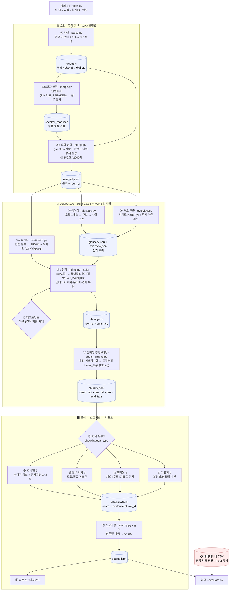

# 🎓 Lecture Analyzer — AI 강의 분석 리포트 생성기 (V1)

> STT로 추출한 강의 스크립트를 LLM으로 분석해, 강사의 **강의력을 다각도로 평가**하고 개선 인사이트를 담은 리포트를 자동 생성하는 시스템

NLP 과제 1 · AI 엔지니어 자연어처리과정 · 4인 1팀 · 4주 프로젝트

> **이 문서(readme_V1)는** 팀 베이스라인 README + 팀원 코드 변경(CTX/MAIN 오버랩·미완성 어미 병합) + KYS 설계(개요 추출·4갈래 라우팅·eval_tags 태깅·KURE 임베딩·2차 EDA)를 **하나의 확정 설계로 통합**한 버전이다. 더 이상 "개인 제안"이 아니라 코드가 따라야 할 스펙이다.

---

## 📌 프로젝트 개요

강의 STT 스크립트를 입력받아, 내부 **강의 품질 평가 체크리스트(5개 카테고리 · 18개 항목)** 를 기준으로
LLM 분석을 수행하고 강의력 스코어와 개선 코칭이 담긴 리포트를 출력한다.

- **입력**: 강의 스크립트(`.txt`) **하나만** — 실서비스 형태(메타데이터는 input 아님, §설계 철학)
- **분석 엔진**: 체크리스트 18항목을 **항목 성격에 따라 4갈래로 라우팅**해 평가 → 항목 점수 + 근거 인용
- **출력**: 강의별 분석 리포트 + 강사별 비교 + 주차별 추이 (대시보드 / PDF)

---

## ✨ 주요 기능

| 기능 | 설명 |
|---|---|
| 텍스트 전처리 | STT 스크립트 정제, 발화 단위 분할(미완성 어미 병합 포함), 화자 매핑 |
| 개요 추출 | 메타 없이 **스크립트에서** 키워드·주제 아웃라인 직접 추출 → 정제 전역 맥락 |
| 임베딩 토픽 분할 | KURE 임베딩 기반 TextTiling-lite로 주제 단위 청킹(LLM 분할은 fallback) |
| eval_tags 태깅 | 청킹 호출에 folding — 각 chunk에 관련 평가항목을 다중 라벨로 미리 부착 |
| 항목별 LLM 분석 | 18항목을 4갈래(지표/위치/검색/전역)로 라우팅, 관련 청크만 투입 |
| 강의력 스코어링 | **항목별 가중**(PDF 근거) → 종합 강의력 스코어 |
| 강사 비교·시계열 | 강사·과목별 비교, 주차별 추이 시각화 |
| 리포트 생성 | 비개발자도 이해 가능한 리포트 자동 출력(PDF/DOCX/대시보드) |

---

## 🧭 설계 철학 — "두 제약"에서 모든 설계가 나온다

### 제약 A. 메타데이터는 정답일 뿐, 입력이 아니다
- `강의 메타데이터.csv`(과목·강사·내용)는 **평가/검증용 정답**. 실제 서비스에서 강사가 분석을 맡길 땐 **STT 스크립트 하나만** 들어온다.
- 게다가 EDA에서 확인했듯 **메타 subject ≠ 실제 내용**(메타=React/HTTP, 실제=Java/SQL). 메타를 input에 쓰면 누설이자 왜곡.
- **결론**: "이 강의가 무엇에 대한 것인가(주제·키워드)"를 **메타가 아니라 스크립트에서 직접 뽑는다**. → 전처리에 **개요 추출(③)** 단계가 있는 근본 이유.

### 제약 B. 루브릭 평가엔 LLM이 필수지만, 무작정 넣으면 안 된다
- 18항목은 "비유를 적절히 들었는가" 같은 **정성 판단** → 규칙으론 불가, **LLM 필수**.
- 그런데 강의 1편이 20만 자. 18항목마다 전체를 LLM에 넣으면 **토큰 비용 폭발** + **needle-in-haystack**(긴 맥락에서 한 근거 찾기 정확도 저하).
- **결론**: 항목마다 **관련 있는 부분만 골라** 넣는다. → "블록 태깅 → 검색 → 부족하면 문맥 확장" 설계(§평가 설계, §태깅)의 근본 이유.

> **전처리의 개요 추출**과 **평가의 항목별 검색**은 다른 문제가 아니라, **"스크립트만으로 자급자족"** 이라는 같은 원칙의 두 얼굴이다.

### 관통 원칙
1. **모델은 ③~⑥에만** — 규칙으로 끝낼 건 규칙으로(①②⑦⑧).
2. **원본 불변 + `raw_ref`** — 모든 산출물이 원본 발화 idx를 참조해 타임스탬프까지 역추적.
3. **단계마다 manifest** — 깃 커밋·버전·입력 해시로 재현성.

---

## 🗂️ 디렉터리 구조

```
lecture-analyzer/
├── README.md                              # 팀 공용 베이스라인 문서
├── readme_V1.md                           # (현재 파일) 통합 확정 설계 — 코드 스펙
├── kys_readme.md                          # KYS 설계 제안 원본(아카이브)
├── .gitignore                             # 데이터·키·아티팩트 제외 설정
├── .env.example                           # 환경 변수 템플릿 (키 값은 비움)
├── src/                                   # 분석 파이프라인 소스
│   ├── config.py                          #   경로·상수·병합/모델/임베딩 파라미터·JVM
│   ├── manifest.py                        #   재현성 manifest(깃·버전·해시·설정)
│   ├── preprocess/                        #   전처리 (Step 1~2, 규칙·GPU 불필요)
│   │   ├── parse.py                       #     ①  txt → raw.jsonl (12h→24h 보정)
│   │   ├── merge.py                       #     ②  화자매핑+발화병합(미완성 어미 병합) → merged.jsonl
│   │   ├── loader.py                      #     (EDA용) STT → DataFrame
│   │   └── text.py                        #     (EDA용·개요용) 토큰화·명사빈도·필러(KoNLPy)
│   ├── refine/                            #   정제 (Step 3~5, 모델·Colab) — P1
│   │   ├── glossary.py                    #     ③  용어집(규칙치환+모델후보)
│   │   ├── overview.py                    #     ③  개요 추출(키워드 KoNLPy + 주제 아웃라인) — §설계철학 A
│   │   ├── sectionize.py                  #     ④a 블록→섹션 + 오버랩 윈도우(CTX/MAIN 태깅)
│   │   ├── refine.py                      #     ④b Solar 정제(체크포인트/재개·CTX/MAIN)
│   │   ├── embedding.py                   #     KURE 임베딩 로더 + 코사인(분할·태깅 공용)
│   │   ├── segment.py                     #     ⑤  임베딩 토픽 분할(TextTiling-lite)
│   │   ├── tagging.py                     #     ⑤  eval_tags 태깅(시드키워드+임베딩 유사도)
│   │   ├── chunk_embed.py                 #     ⑤  clean→chunks(임베딩 분할+태깅 folding) ★메인
│   │   ├── chunk.py                       #     ⑤  LLM 청킹(fallback)
│   │   ├── prompts.py / jsonout.py        #     프롬프트 / 모델출력 JSON 파싱
│   │   └── model.py                       #     Solar-10.7B 로더/generate_fn
│   ├── analyze/                           #   분석 엔진 (P2) — 18항목 4갈래 라우팅 평가
│   │   ├── checklist.py                   #     18항목 정의(진실원천·weight·eval_type·seed_keywords)
│   │   ├── metrics.py 🚧                  #     지표 선계산(pace·filler·존반말·미완결)
│   │   ├── router.py 🚧                   #     항목→입력 선별 + eval_type 디스패치
│   │   ├── context_expand.py 🚧          #     raw_ref 인접 블록 확장(풀버전 문맥확장)
│   │   ├── prompts.py / engine.py         #     유형별 프롬프트 / chunks→analysis.jsonl
│   ├── scoring/                           #   스코어링·검증 (P3)
│   │   ├── scoring.py                     #     항목별 가중 → 종합점수
│   │   └── evaluate.py                    #     메타데이터(정답) 기반 검증
│   ├── report/                            #   리포트·대시보드 (P4)
│   │   ├── build.py                       #     강의별 리포트(MD→PDF/DOCX)
│   │   └── dashboard.py                   #     Streamlit 대시보드 스텁
│   └── eda/report.py                      #   EDA 통계·차트·리포트 엔진
├── scripts/
│   ├── run_preprocess.py                  # ①~② 실행(로컬, GPU 불필요)
│   ├── run_eda.py                         # EDA 리포트 실행
│   ├── smoke_refine.py                    # ③~④ 배관 스모크(모델 stub)
│   └── smoke_chunk_embed.py              # ⑤ 임베딩 청킹·태깅·개요 배관 스모크(임베더 stub)
├── notebooks/
│   ├── 01_eda.ipynb                       # 인터랙티브 EDA
│   └── 02_refine_colab.ipynb             # Colab(A100): ③~⑤ 정제·청킹·태깅 파이프라인
├── requirements.txt                       # 로컬(전처리·EDA) — 버전 고정
├── requirements-colab.txt                 # Colab(모델·임베딩 추론) — 버전 고정
├── docs/SCHEMA.md                         # 단계 간 JSONL 데이터 계약
├── outputs/                               # ⛔ 산출물 (git 미포함)
└── AI_Lecture_Analysis_Report_Generator/  # ⛔ 제공 데이터 (git 미포함, 로컬 전용)
```

> ⚠️ `AI_Lecture_Analysis_Report_Generator/` 는 제공 데이터·체크리스트 PDF를 담고 있으며
> **`.gitignore`에 의해 저장소에 포함되지 않습니다.** 로컬에서만 사용하세요.

---

## 🚀 시작하기

```bash
# 1. 가상환경 (Python 3.13 권장 — 3.14 alpha는 패키지 호환 이슈)
python3.13 -m venv .venv && source .venv/bin/activate

# 2. 의존성 설치
pip install -r requirements.txt

# 3. 환경 변수 설정 (.env.example 복사 후 키 입력)
cp .env.example .env        # 정제에 Upstage 백엔드 쓰면 UPSTAGE_API_KEY=... 입력

# 4. EDA 리포트 생성
python -m scripts.run_eda
#   → outputs/eda/eda_report.md + figures/*.png 생성
```

### 🔑 Solar 백엔드 (정제 ④) — Upstage API / HF 오픈모델
정제 단계 LLM은 `config.MODEL_BACKEND`로 분기한다(둘 다 `generate_fn(messages)->str` 동일 인터페이스):
- **`"upstage"`(기본)** — Upstage Solar API(클라우드, OpenAI 호환). **GPU 불필요 → 로컬에서도 정제 가능**. 키 필요.
- **`"hf"`** — HuggingFace 오픈모델 `SOLAR-10.7B-Instruct`. Colab A100(fp16) 필요.

**UPSTAGE_API_KEY 넣는 곳** (https://console.upstage.ai 발급):
- **로컬**: `.env` 에 `UPSTAGE_API_KEY=...` → `config.py`가 시작 시 자동 로드(python-dotenv). 또는 `export UPSTAGE_API_KEY=...`.
- **Colab**: 노트북 백엔드 셀에서 `getpass`로 입력(키가 코드/Drive에 안 남음). 또는 Drive `.env`.
- 모델명·엔드포인트는 `config.UPSTAGE_MODEL`(`solar-pro2`)·`UPSTAGE_BASE_URL`에서 조정.

### 🧩 임베딩 백엔드 (청킹·태깅 ⑤) — Upstage API / KURE
임베딩도 `config.EMBED_BACKEND`로 분기(둘 다 `embed_fn(texts)->ndarray` 동일 인터페이스):
- **`"upstage"`(기본)** — Upstage 임베딩 API. 같은 `UPSTAGE_API_KEY` 사용, **모델 다운로드·GPU 불필요**.
- **`"kure"`** — `nlpai-lab/KURE-v1`(품질 1순위·§연구근거). `sentence-transformers` 필요, ~2GB 다운로드, GPU 권장(CPU 가능).

> ✅ **GPU 없이 전체 로컬 실행**: `MODEL_BACKEND=upstage` + `EMBED_BACKEND=upstage`면 ③④⑤가 전부 API 호출이라 **`openai` 패키지 + 키 하나로 로컬에서 끝**난다(KURE 다운로드·Colab 불필요). KURE 품질이 필요할 때만 `EMBED_BACKEND=kure`.

### KoNLPy(형태소 분석) 주의
KoNLPy는 **Java(JDK)** 가 필요합니다. JPype 최신 버전 + JDK 조합에서 JVM 경로 탐지 버그가 있어,
[src/config.py](src/config.py)의 `resolve_jvm_path()`가 `JAVA_HOME` 또는 `/usr/libexec/java_home`에서
경로를 직접 찾아 넘깁니다. Java가 없으면 EDA·개요의 키워드 분석만 건너뛰고 나머지는 정상 생성됩니다.

### 📊 EDA 주요 발견 (1차 — 데이터 이해)
- **STT 타임스탬프는 12시간제(AM/PM 미표기)** → 01~06시를 13~18시로 보정 처리.
- **메타데이터 과목명 ≠ 실제 강의 내용** — 메타는 HTML/React/HTTP인데 실제 발화는 Java IO·SQL/DB. `subject`를 정답 라벨로 신뢰 불가 → **개요 추출(③)의 근거**.
- **사실상 단일화자(강사)** — 강사 글자 비중 ~92%, 소수 '학생1/학생2' 라벨은 STT 오인식 아티팩트. → **전부 강사로 취급**(`config.SINGLE_SPEAKER=True`). 진짜 학생 발화가 없으므로 `C5_answer`는 강사의 **질문 유도·응답 상호작용 뉘앙스**로 재해석해 평가(§평가 설계).
- 음성 인식 오류 다수(예: '잡바'=Java) → 도메인 용어 정규화 사전(용어집 ③) 필요.
- 자세한 내용은 `outputs/eda/eda_report.md`(로컬 생성) 참고.

---

## 🔧 전처리·정제·분석 파이프라인

원본 STT를 LLM 분석에 쓸 수 있는 형태로 가공한 뒤, 18항목을 4갈래로 라우팅해 평가한다.



| 단계 | 방식 | 입력 → 출력 | 위치 | 상태 |
|---|---|---|---|---|
| ① 파싱 | 규칙 | txt → `raw.jsonl` | 로컬 | ✅ |
| ②a 화자 매핑 | 규칙 | raw → `speaker_map.json` | 로컬 | ✅ |
| ②b 발화 병합 | 규칙 | raw(+맵) → `merged.jsonl` | 로컬 | ✅ + 미완성 어미 |
| ③ 용어집 | 모델 | merged → `glossary.json` | Colab | ✅ |
| ③ 개요 추출 | 규칙+모델 | merged → `overview.json` | Colab | ✅ (refine 배선 TODO) |
| ④a 섹션화 | 규칙 | merged → 섹션(+오버랩 CTX/MAIN) | Colab | ✅ |
| ④b 정제 | 모델(Solar) | 섹션+용어집(+개요) → `clean.jsonl` | Colab | ✅ (개요 주입 TODO) |
| ⑤ 임베딩 청킹+태깅 | 임베딩 | clean → `chunks.jsonl`(eval_tags) | Colab | ✅ |
| ⑥ 분석 | 모델 | chunks → `analysis.jsonl` | 로컬/Colab | ✅ 4갈래 라우팅 |
| ⑦ 스코어링 | 규칙 | analysis → `scores.json` | 로컬 | ✅ 항목가중 |
| ⑧ 리포트 | 규칙 | scores → 강의별 MD 리포트 | 로컬 | ✅ (대시보드 🚧) |

### 단계별 상세

**① 파싱 (규칙 · 로컬)** — [src/preprocess/parse.py](src/preprocess/parse.py)
- 입력: `강의 스크립트/*.txt`. 한 줄 = `<HH:MM:SS> 화자ID: 발화`.
- 정규식으로 `{시각, 화자ID, 발화}` 분해. STT는 **12시간제(AM/PM 미표기)** → `01~06시를 13~18시로 보정`(`to_24h`). 정형 이탈 줄은 버리지 않고 `malformed=True`로 보존.
- 출력: `raw.jsonl` — 발화 1건=1행, 전역 `idx`, `sec_of_day`(병합용), `session`(오전/오후). 모든 후속 산출물이 이 `idx`를 `raw_ref`로 참조.

**②a 화자 매핑 (규칙 · 로컬)** — [src/preprocess/merge.py](src/preprocess/merge.py)
- 해시 화자ID가 **세션마다 바뀌므로 파일(일자) 단위**로 집계.
- **단일화자 취급(`config.SINGLE_SPEAKER=True`)**: 제공 데이터는 강사 글자 비중 ~92%이고 소수 '학생' 라벨은 STT 오인식 아티팩트 → **모든 화자ID를 `강사`로 라벨**. 진짜 다화자 데이터가 들어오면 `False`로 바꾸면 발화량 순 `학생N` 매핑이 살아난다(동률이면 경고 로그 + `speaker_id` 안정 정렬 — [팀원] 재현성).
- 출력: `speaker_map.json` `{파일: {화자ID: 역할}}` — **사람이 수동 보정 가능**.

**②b 발화 병합 (규칙 · 로컬)** — [src/preprocess/merge.py](src/preprocess/merge.py)
- 같은 화자의 연속 발화를 **시간 간격 `gap≤20초`** 기준으로 한 블록으로 병합 → "한 문장이 여러 타임스탬프로 쪼개진" 문제 해결.
- 근거: 측정 결과 동일화자 연속 gap 중앙값 10초·81%가 ≤15초 → 원안 2~3초는 과분할이라 **20초로 상향**.
- **[팀원] 미완성 어미 강제 병합**: 발화가 `~고/~서/~면/~는데/~니까/~지만/~거나/~도록/~어서/~아서` 등 접속 어미로 끝나면(`is_incomplete`), **gap 임계값을 넘어도** 같은 화자의 다음 발화를 강제로 이어 붙인다. gap만으론 못 잡던 "문장 중간에 길게 끊긴" 경우 보강.
- **상한은 유지**: 미완성 어미여도 `max_block_sec(150초)`/`max_block_chars(2000자)` 초과 시엔 강제 분리(블록 폭주 방지).
- 출력: `merged.jsonl` — 블록 `{start/end_time, speaker_role, text, raw_ref[]}`.

**③ 용어집 (모델 1패스 + 사람 검수 · Colab)** — [src/refine/glossary.py](src/refine/glossary.py)
- 본 정제 전에 전사를 싸게 1패스 훑어 **STT 오류 후보(`잡바→Java`)·핵심 용어**를 모아 `glossary_candidates.json` 생성 → **사람 검수** → `glossary.json` 확정.
- `corrections` 중 `rule:true`는 ④에서 모델 호출 **전에 결정적 치환**(일관성↑·모델부담↓), 나머지는 모델이 문맥으로 처리. `SEED_GLOSSARY`(EDA 확인 오류)가 시작점.

**③ 개요 추출 (규칙 + 모델 · Colab)** — [src/refine/overview.py](src/refine/overview.py) · §설계 철학 A
- **메타를 input으로 못 쓰므로**, 강의 주제·키워드를 **스크립트에서 직접** 뽑아 정제(④)의 **전역 맥락**으로 쓴다. 정제 시 도메인 맥락이 없으면 STT 오류 복원이 망가지는 빈틈을 채운다(예: "조인"을 일상어로 오교정 방지).
- **비용 설계(점진 도입)**:
  1. **키워드 = KoNLPy 명사빈도**(무료·길이무관) — 항상 가능.
  2. **주제 아웃라인 = map-reduce 요약**(Solar 4k 한계 → 섹션 요약→합치기) — `generate_fn` 있을 때만.
- **요약 2분리 원칙**: 여기 개요는 **정제 전 거친 가이드**(raw 기반, 맥락 힌트). 리포트용 **최종 요약은 정제 후 별도**(clean 기반, 깔끔).
- 출력: `overview.json` `{lecture_id: {keywords, outline}}`.
- ⚠️ **구현 갭(코드 수정 대상)**: `overview.py`는 완성됐으나 **`refine.py`가 아직 overview를 주입하지 않음**(현재 직전 섹션 요약만 사용). → §코드 수정에서 배선.

**④a 섹션화 (규칙 · Colab)** — [src/refine/sectionize.py](src/refine/sectionize.py)
- 정제는 문장 단위❌ **큰 섹션 단위**(맥락 보존). 같은 파일·세션 내 인접 블록을 `2500자` 한도로 누적. `block_ids`/`raw_ref` 유지.
- **[팀원] 오버랩 윈도우 + [CTX]/[MAIN] 태깅**: `make_sections_with_overlap()`이 각 섹션 앞뒤에 이웃 섹션 블록을 `overlap_blocks`개씩 `ctx=True`로 포함시킨다. `render_section()`이 맥락 블록은 `[CTX]`, 정제 대상은 `[MAIN]`으로 감싼다. → **섹션 경계에 걸린 문장**을 자연스럽게 완성. 단 `block_ids`/`raw_ref`는 **MAIN 블록 기준만** 유지(추적성).
- ⚠️ **구현 갭(코드 수정 대상)**: 노트북이 아직 `make_sections`(오버랩 없음)을 호출 → `make_sections_with_overlap`으로 전환 필요.

**④b 정제 (모델 Solar-10.7B · Colab)** — [src/refine/refine.py](src/refine/refine.py)
- 입력 프롬프트 = `rule 치환 적용 [MAIN] 원문` + `[확정 용어집]` + `[직전 섹션 요약]`(+ **[개요] ← 배선 예정**).
- **[팀원] CTX/MAIN 처리**: `[CTX]` 블록은 맥락 파악만(출력 금지), `[MAIN]`만 정제해 `clean_text`로. 경계 복원(첫/끝 문장이 CTX로 이어지면 자연스럽게 완성하되 내용 추가·왜곡 금지).
- **체크포인트**: 섹션 1건 정제할 때마다 `clean.jsonl`에 즉시 append+flush. Colab 끊겨도 **처리한 `section_id`는 건너뛰고 재개**(Drive에 두면 영속).
- **[팀원] fallback 수정**: JSON 파싱 실패 시 원문 보존하되 `[CTX]` 줄은 제거하고 `[MAIN]`만 남긴다(CTX 누설 버그 수정).
- 출력: `clean.jsonl` `{section_id, clean_text, summary, raw_ref}`.

**⑤ 임베딩 청킹 + eval_tags 태깅 (임베딩 · Colab)** — [src/refine/chunk_embed.py](src/refine/chunk_embed.py) ★ §태깅·§연구근거
- 정제 텍스트를 문장열로 펴서 **임베딩 1회** → **두 가지를 같은 임베딩으로(folding)**:
  - **(a) 토픽 분할** ([segment.py](src/refine/segment.py)): 인접 문장 유사도의 '골(depth)'에서 주제 경계를 찾는 **TextTiling-lite**(문헌 TreeSeg/TextTiling 근거 — LLM 분할보다 싸고 일관적).
  - **(b) eval_tags 태깅** ([tagging.py](src/refine/tagging.py)): 각 chunk에 관련 평가항목을 **다중 라벨**로 부착(시드 키워드 + KURE 임베딩 유사도). 도입/종료 항목은 위치(`pos`) 게이트.
- **추가 LLM 호출 0회** — 태깅은 청킹 임베딩에 folding(§태깅 비용 설계).
- 출력: `chunks.jsonl` `{chunk_id, lecture_id, pos, clean_text, raw_ref, time_range, eval_tags[]}` — **분석부(⑥) 입력**.
- LLM 청킹([chunk.py](src/refine/chunk.py))은 **fallback**(임베딩 불가 환경). `topic` 라벨 사용.

**⑥ 분석 (모델 · Colab)** — [src/analyze/engine.py](src/analyze/engine.py) *(P2)*
- 강의(=`lecture_id`) 단위로 18항목을 **`eval_type`에 따라 4갈래 라우팅**해 평가 → 항목별 `{score 1~5, verdict, evidence[{chunk_id, quote}], comment}`. 체크포인트/재개.
- 🟠 검색형은 **태깅된 청크만 + 풀버전 문맥확장**, 🔵 지표형은 **숫자 선계산 후 규칙 채점**, 🔴 전역형은 **압축 전역 뷰**. **상세 알고리즘·모듈 계획은 아래 「⚙️ ⑥ 분석 엔진 상세 로직」 섹션**.
- 출력: `analysis.jsonl`(항목 1건=1행).

**⑦ 스코어링 (규칙 · 로컬)** — [src/scoring/scoring.py](src/scoring/scoring.py) *(P3)*
- **항목별 가중**(PDF 근거: 높음/중간/낮음) → 0~100 종합 강의력 점수. 강사/세션 비교, 주차 추이.
- `evaluate.py`가 **메타데이터(정답)** 로 커버리지·정확도 검증(⚠️ 메타는 검증 전용, input 금지).

**⑧ 리포트/대시보드 (규칙 · 로컬)** — [src/report/](src/report/) *(P4)*
- 강의별 리포트(MD→PDF/DOCX) + Streamlit 대시보드(점수·근거 인용 드릴다운).

### 실행

```bash
# 로컬: ①~② (GPU 불필요)
python -m scripts.run_preprocess     # raw.jsonl, merged.jsonl, speaker_map.json, manifest
python -m scripts.smoke_refine       # (선택) ③~④ 배관 점검 — 모델 stub
python -m scripts.smoke_chunk_embed  # (선택) ⑤ 임베딩 청킹·태깅·개요 배관 점검 — 임베더 stub
```

```
# Colab: ③~⑤ (Solar 백엔드 선택 + KURE 임베딩)
1. outputs/processed/merged.jsonl 을 Google Drive MyDrive/lecture-analyzer/ 에 업로드
2. notebooks/02_refine_colab.ipynb 를 Colab에서 열고 백엔드 셀에서 BACKEND 선택
   - upstage: GPU 불필요(키 입력) · hf: 런타임 A100
3. 순서대로 실행. 산출물(clean.jsonl, chunks.jsonl)은 Drive에 1건씩 체크포인트 — 끊겨도 해당 셀만 재실행하면 재개
```

> 코드는 repo에서, **데이터는 Drive에서**(분리). 데이터·정제 산출물은 git/공개 업로드 금지.

---

## 📐 평가 설계 — 18항목을 4갈래로 라우팅 (PDF 근거)

`강의 품질 기준.pdf`의 세부기준·가중치를 확인한 결과, 18항목은 성격이 **4종류**라 한 방식으로 못 민다.
유형은 [src/analyze/checklist.py](src/analyze/checklist.py)의 `eval_type`에 박혀 있다.

평가유형: 🔵 metric(지표 계산) · 🟢 intro(도입부) · 🟡 outro(종료부) · 🟠 local(국소-분산·검색) · 🔴 global(전역)

| 항목 (key) | 가중 | 유형 | 시드 키워드 / 신호 |
|---|---|---|---|
| 불필요한 반복 `C1_repetition` | 높음 | 🔵🔴 | 필러 빈도(이제·그래서·막·뭐) — 전역 빈도 계산 |
| 발화 완결성 `C1_completeness` | 중간 | 🔴 | 미완결/끊긴 문장 비율 — 전역 |
| 언어 일관성 `C1_consistency` | 중간 | 🔴 | 존댓말/반말 혼용 — 전역 |
| 학습 목표 안내 `C2_objective` | 높음 | 🟢 | 오늘·목표·배울·진행 순서·할 거예요 (도입부) |
| 전날 복습 연계 `C2_review` | 높음 | 🟢 | 지난 시간·저번·복습·어제·앞에서 (도입부) |
| 설명 순서 `C2_order` | 중간 | 🔴 | 개념→예시→실습 흐름 — 전역 구조 |
| 핵심 내용 강조 `C2_emphasis` | 중간 | 🟠 | 중요·꼭·반드시·핵심·기억·포인트 |
| 마무리 요약 `C2_summary` | 낮음 | 🟡 | 정리·요약·오늘 배운·마무리 (종료부) |
| 개념 정의 `C3_definition` | 높음 | 🟠 | ~란·~이란·정의·~라고 합니다·의미 |
| 비유 및 예시 `C3_analogy` | 높음 | 🟠 | 예를 들어·비유·마치·~처럼·쉽게 말하면·실생활 |
| 선행 개념 확인 `C3_prerequisite` | 중간 | 🔴 | 심화로 급점프 여부 — 전역 구조 |
| 발화 속도 적절성 `C3_pace` | 중간 | 🔵 | **분당 글자/발화수**(타임스탬프 계산, LLM 거의 불필요) |
| 예시 적절성 `C4_example` | 높음 | 🟠 | 예시·실무·현업·실제·사례·예로 |
| 실습 연계 `C4_practice` | 높음 | 🟠 | 실습·해보·직접·따라·코드·쳐보·실행 |
| 오류 대응 `C4_error` | 중간 | 🟠 | 오류·에러·안 돼·왜 안·버그 |
| 이해 확인 질문 `C5_check` | 높음 | 🟠 | **되셨어요·이해하셨·아시겠·맞죠·괜찮으세요** |
| 참여 유도 `C5_engage` | 높음 | 🟠 | 해보세요·풀어·직접 해·해볼까요·같이 |
| 질문 응답·상호작용 `C5_answer` | 높음 | 🟠 | **질문 유도·응답 뉘앙스**(질문 있으세요·왜 안 될까요 후 설명) — 단일화자라 강사 발화로 평가 |

> 가중치: 높음 / 중간 / 낮음 (PDF). **P3 스코어링은 카테고리가 아니라 항목별 가중**으로 간다.

### 🟠 검색형(local, 9항목) — 핵심 동작
대상: 개념정의·비유·강조·예시·실습·오류·이해확인·참여·질문응답.
```
정제된 chunk(eval_tags 부착됨) ─┐
   ├─(1) 태깅(⑤에서 이미 완료): 시드 키워드 OR 임베딩 유사도(>임계) → item별 관련 chunk
   ├─(2) 평가: 항목별 태깅된 top-k chunk만 LLM에 투입
   ├─(3) 부족하면 문맥 확장: raw_ref/시간 인접 블록 N개 추가 (최대 1~2회)
   └─(4) 관련 chunk 0개 = 부정 증거(강사가 안 함) → 낮은 점수 + 전역 1회 교차확인
```
- **(1) 키워드만으론 약하다** → "예시"란 단어 없이 예시를 들 수 있음(lexical gap). **KURE 임베딩 유사도 병행**으로 의역까지 잡는다.
- **(3) 확장은 1~2회 제한** — LLM이 "근거 부족" 플래그 반환 시에만.
- **(4) "못 찾음 = 부정 증거"**(에러 아님). lexical gap 오탐 방지로 전역 뷰 1회 교차확인.
- **태깅 산출물이 그대로 `evidence[{chunk_id, quote}]`** → `analysis.jsonl` 직결, 추적성 강화.

### 나머지 3갈래
- **🟢🟡 위치형(intro 2 + outro 1)**: 학습목표·복습은 **도입부 청크**(`pos≤INTRO_RATIO`), 마무리요약은 **종료부 청크**(`pos≥1-OUTRO_RATIO`)만. 전체 검색 불필요 → 비용 절약.
- **🔴 전역형(4)**: 언어일관성·설명순서·선행개념·발화완결성은 블록 검색 불가 → **개요·구조 + 지표**로 판정.
- **🔵 지표형(2)**: 발화속도(분당 글자·타임스탬프), 필러빈도(EDA 기존) → **LLM 전에 숫자로** 산출, LLM은 해석만.

> ⚠️ **단일화자 재해석**: 제공 데이터는 사실상 강사 1명(§EDA)이라 진짜 학생 Q&A가 없다. `C5_answer`를 "학생 발화 뒤 강사 응답"으로 보면 항상 N/A가 되어 죽은 항목이 되므로, **강사가 질문을 유도하고 답하려는 상호작용 뉘앙스**(예: "질문 있으세요?", "왜 안 될까요?" 후 설명)로 재해석해 강사 발화만으로 평가한다(`needs_student=False`). 진짜 다화자 데이터가 오면 `needs_student`/`SINGLE_SPEAKER`로 원래 의미 복원.

---

## ⚙️ ⑥ 분석 엔진 상세 로직 (4갈래 라우팅 · 구현 예정 P2)

§평가 설계의 4갈래를 **실행 가능한 알고리즘**으로 구체화한다. 핵심은 *항목마다 전체를 다시 읽지 않는다* — `eval_type`으로 라우팅해 **필요한 입력만** LLM에 넣는다.

### 입력 / 출력
- **입력**: `chunks.jsonl`(eval_tags·pos·raw_ref·clean_text) + `overview.json`(전역 맥락) + `merged.jsonl`(타임스탬프·문맥확장용 원본 블록) + `clean.jsonl`(섹션 요약, 전역형용)
- **출력**: `analysis.jsonl` — 강의×18항목, 1항목=1행. **체크포인트/재개**(이미 평가된 `(lecture_id, item_key)`는 건너뜀 — refine과 동일 패턴).

### 라우터 (의사코드)
```python
for lecture in group_by_lecture(chunks):           # lecture_id = f"{date}_{session}"
    metrics  = compute_metrics(lecture.chunks, lecture.blocks)   # 지표 1회 선계산
    overview = overviews[lecture.id]
    for item in CHECKLIST:                          # 18항목
        et = item["eval_type"]
        if   et == "metric":          row = eval_metric(item, metrics)
        elif et in ("intro","outro"): row = eval_position(item, lecture.chunks)
        elif et == "local":           row = eval_local(item, lecture.chunks, lecture.blocks)
        elif et == "global":          row = eval_global(item, lecture, overview, metrics)
        append_and_flush(out, row)                  # 체크포인트
```

### 🔵 metric (2) — `C1_repetition`, `C3_pace` · **LLM 전에 숫자로**
- `metrics.py`가 결정적으로 선계산:
  - `pace`: 분당 글자수·발화수 = Σ글자 / 총 발화시간(분) — `merged` 타임스탬프(`dur_sec`)에서.
  - `filler_rate`: 필러 토큰수 ÷ 전체 토큰수(`config.FILLER_WORDS`).
- **점수는 규칙**(임계값 → 1~5, 임계값은 §2차 EDA로 캘리브레이션). LLM은 **해석/코멘트만** (선택). `evidence`엔 수치를 남김 → 리포트에서 "분당 OOO자".

### 🟢🟡 position (3) — `C2_objective`·`C2_review`(intro), `C2_summary`(outro)
- `pos` 게이트로 **도입부/종료부 청크만** 후보(`pos≤INTRO_RATIO` / `pos≥1-OUTRO_RATIO`, 첫·끝 청크는 항상 허용). eval_tags가 이미 위치 게이트를 반영하므로 **해당 항목 태깅 청크**가 곧 후보.
- 후보만 LLM 투입. 후보 0개 = **부정 증거**(도입부에 목표 안내/복습 안 함) → 낮은 점수.

### 🟠 local (9) — 검색형 · **풀버전 문맥확장**
```python
def eval_local(item, chunks, blocks):
    cands = sorted([c for c in chunks if tagged(c, item)], key=sim, reverse=True)
    if not cands:                                   # (4) 태그 0개 = 부정 증거 후보
        cross = llm_cross_check(item, condensed(chunks), overview)   # lexical-gap 오탐 방지 1회
        return cross if cross.found else negative(item)              # 못 찾으면 낮은 점수
    ctx = render(cands[:TOP_K])                     # (2) 항목별 top-k만
    for attempt in range(MAX_EXPAND + 1):           # (3) 풀버전 확장 루프
        out = llm(local_prompt(item, ctx))          #     {score, evidence, comment, needs_more}
        if not out.needs_more or attempt == MAX_EXPAND:
            return out
        ctx = expand_context(cands[:TOP_K], blocks, n=EXPAND_BLOCKS * (attempt + 1))
```
- **(3) 문맥확장(풀버전)**: LLM이 `needs_more=true`("근거 부족")를 반환할 때만, evidence 청크의 `raw_ref`로 **시간 인접 원본 블록**을 N개 끌어와(`[확장맥락]` 태그) 재조회. 최대 `MAX_EXPAND`(1~2)회. 무한 확장 방지.
- **(4) 부정 증거**: 항목 태그가 강의 전체에서 0개면 "강사가 안 함"으로 보되, lexical-gap 오탐 방지로 **전역 뷰 1회 교차확인** 후 확정. (태깅 단계 `coverage()`가 0 항목을 미리 알려줌)
- 태깅 결과(`{chunk_id, cue, sim}`)가 그대로 `evidence`로 흐름 → 추적성 공짜.

### 🔴 global (4) — `C1_completeness`·`C1_consistency`·`C2_order`·`C3_prerequisite`
- 블록 검색 불가 → **압축 전역 뷰**로 판정: `overview.outline` + 섹션 요약(`clean.summary`) + 토픽 시퀀스 + **지표 신호**.
  - `C1_completeness` ← 미완결 문장 비율(`is_incomplete` 재사용) 지표 + 샘플.
  - `C1_consistency` ← 존댓말/반말 어미 비율 지표 + 샘플.
  - `C2_order` ← 청크 `topic`/outline **순서 시퀀스**(개념→예시→실습 흐름).
  - `C3_prerequisite` ← outline 인접 주제 난이도 점프 여부.
- 압축 뷰만 LLM 투입(전체 재독 ❌).

### 🗣️ 상호작용 항목(C5) — 문맥 윈도우 LLM (교실담화 연구 정석)
`C5_check`·`C5_engage`·`C5_answer`는 **어투·상호작용 뉘앙스**라 임베딩 유사도만으론 약하다. 교실담화 자동평가 문헌(arXiv 2306.14918)은 단일 문장이 아니라 **"현재 발화 + 직전 턴"의 문맥 윈도우**로 분류하고, 강사의 **uptake(학생 발화 받아주기)·IRE 패턴**을 본다.
- ⑤ 태깅은 **후보 chunk만** 잡고(dense+키워드), 확정은 ⑥에서 **LLM이 해당 chunk + `raw_ref` 인접 턴(문맥 윈도우)을 읽고** 톤·상호작용을 판정 → 검색형 (3)단계 문맥확장과 같은 메커니즘.
- ⚠️ **전사본 한계**: 어투·전달력·강사 presence 등 **비텍스트 요소는 전사본에 없다**(문헌도 "명료성"에서 텍스트-학생평가 일치가 약함을 보고). 우리 점수는 **렉시컬 프록시까지**임을 리포트에 명시.

### 부정 증거 · N/A 정책
- **부정 증거**(태그 0 + 교차확인 실패) = 점수 낮음(1~2) + `routing.negative_evidence=True`. 에러 아님.
- **N/A**(`score=null`): `needs_student` 미충족 등 평가 불가. 단일화자라 현재 N/A 없음(§단일화자).

### analysis.jsonl 스키마 (확장)
```jsonc
{ "lecture_id": "2026-02-02_오전", "file": "...", "date": "...", "session": "오전",
  "item_key": "C3_analogy", "category": "C3", "eval_type": "local",
  "score": 4, "verdict": "양호",
  "evidence": [{"chunk_id": 12, "quote": "마치 물을 따르는 것과 같습니다"}],
  "metric": null,                                   // metric 유형이면 {name, value}
  "comment": "근거 기반 한두 문장",
  "routing": {"n_candidates": 3, "expanded": 0, "negative_evidence": false, "cross_checked": false} }
```

### 구현 모듈 계획 (P2 · 아직 코드 미작성)
| 모듈 | 역할 |
|---|---|
| `src/analyze/metrics.py` 🚧 | 지표 선계산(pace·filler·존반말·미완결) — `merged`/`config.FILLER_WORDS` 재사용 |
| `src/analyze/router.py` 🚧 | 항목→입력 선별 + `eval_type` 디스패치(local/position/global/metric) |
| `src/analyze/context_expand.py` 🚧 | `raw_ref` 인접 원본 블록 확장(풀버전 (3)단계) |
| `src/analyze/prompts.py` 🚧 | 유형별 프롬프트(local/position/global/metric-해석) + `needs_more` 플래그 |
| `src/analyze/engine.py` 🚧 | `run_analysis` 루프 — 라우팅·확장·체크포인트/재개 |

### config 추가 예정 (§2차 EDA로 캘리브레이션)
`ANALYZE_TOP_K=4` · `ANALYZE_MAX_EXPAND=2` · `ANALYZE_EXPAND_BLOCKS=2` · `PACE_CPM_LOW/HIGH`(속도 컷) · `FILLER_RATE_HIGH`(필러 기준선) — 임계값은 2차 EDA 측정치로 확정.

---

## 🏷️ eval_tags 태깅 설계 — 전처리 산출물에 미리 붙인다

### 목표
**전처리가 끝나면 각 chunk에 "관련 평가항목 태그(`eval_tags`)"가 이미 붙어 있게** 한다.
평가(⑥)는 *전체를 다시 읽지 않고* "이 항목에 태깅된 chunk만" 꺼내 채점한다.

```jsonc
{ "chunk_id": 42, "clean_text": "...자 이거 되셨어요? 예를 들어 EMP 테이블을 보면...",
  "eval_tags": [ {"item_key": "C5_check",   "sim": 0.62, "cue": "되셨어요"},
                 {"item_key": "C3_analogy", "sim": 0.55, "cue": "예를 들어"} ] }
```
→ **다중 라벨**(한 chunk가 여러 항목), **0개도 허용**(일반 강의 내용).

### 왜 dense 의미검색이 주 신호인가 (문헌 근거)
루브릭 평가 근거 검색의 **문헌 표준은 dense(의미) 검색**이지 키워드가 아니다:
- **RubricRAG**: 근거를 dense 임베딩으로 검색 — 의미기반이 어휘기반보다 downstream 우위(Spearman ρ 0.545 vs 파인튜닝 0.457), 검색이 환각 8.7%→3.1%로 감소.
- **DAT(하이브리드)**: dense + 키워드(BM25)를 **가중**해 섞되 dense가 백본. 키워드는 버리지 않고 **보조**.

### 검색 방식 = 항목당 top-k (임계값 전체긁기 ❌ — 표준 RAG)
> 실측 교훈: "sim ≥ 임계값인 청크 **전부** 태깅"하면 추상항목(C4_error)이 청크의 절반에 붙는다(과태깅). 표준은 **항목마다 가장 관련된 top-k만 검색**(RubricRAG k=5~20).

→ **검색 규칙**([tagging.py](src/refine/tagging.py)): 항목(=쿼리)마다 —
```
후보 = 위치게이트 & ( sim ≥ TAG_RETRIEVE_FLOOR  OR  cue & sim ≥ TAG_FLOOR_KW )
태깅 = 후보를 score(=sim + cue 시 TAG_KEYWORD_BONUS) 내림차순 top-k(TAG_TOP_K)
후보 0개 → 태그 0 = 항목 부재(부정 증거 후보)
```
- **dense 유사도가 랭킹 주신호**. **고정밀 cue**(처럼·되셨어요·에러…)는 `TAG_FLOOR_KW`로 floor를 낮춰 **저sim 진짜 인스턴스를 살리고**(예: "세 들어 사는 사람처럼" 비유), 가산점으로 generic 임베딩 FP 위로 끌어올린다.
- **동음이의 cue 제거**(checklist): `실행`(execution)·`따라`(조사)·`오류`(API명)·`코드`(코드값)·`순서`(방문순서) 등은 시드에서 뺐다 — 구어체·기술 homonym FP 차단.
- ⑤는 **완벽할 필요 없는 recall 후보생성기** — top-k 안의 오탐은 **⑥ LLM이 읽고 거른다**(precision). `floor`/`floor_kw`/`top_k`는 §2차 EDA로 캘리브레이션.
- 실측(2026-02-03·95청크): 총 태그 192→85, 과발화(C4_error 49→10) top-k로 캡, 위치형(복습 1/요약 2)은 낮게 유지(부정증거 보존), 진짜 비유 cue 구제 복원.

### 💰 비용 핵심: 별도 패스 만들지 말고 **기존 임베딩에 folding**
태깅만 하려고 한 바퀴 더 돌리면 토큰 낭비. 대신 **⑤ 임베딩 청킹이 이미 문장 임베딩을 계산**하니, 그 임베딩을 태깅에 재사용 → **추가 호출 0회**([chunk_embed.py](src/refine/chunk_embed.py)).

### "태그 0개"와 "전혀 안 나온 항목" = 신호다
- chunk 태그 0개 = 일반 설명(정상). 버리지 않음.
- **강의 전체에서 특정 항목 태그가 하나도 안 나옴** = 강사가 그걸 안 했다는 **부정 증거**(예: `C2_review` 태그 0 → 복습 안 함 → 낮은 점수). 단 lexical gap 오탐 방지로 전역 1회 교차확인. → `tagging.coverage()`가 항목별 커버리지 산출.

---

## 11. 연구·모델 근거 → 계획 반영

> 유사 주제(STT 전사 전처리, disfluency 제거, 토픽 분할, LLM 루브릭 평가) 논문/모델과 우리 계획을 대조하고, **더 적합한 부분은 계획을 수정**했다.

| 단계 | 문헌 표준 | 우리 계획 | 판정 / 조치 |
|---|---|---|---|
| 구두점 복원 | 핵심 단계 | 불필요(STT에 이미 있음) | ✅ 난관 하나 공짜 통과 |
| disfluency/구어체 | 전용 모델 | LLM(Solar) 일괄 | ⚠️ **한국어 전용 모델 부재** → LLM 유지 정당화 |
| 문장 병합 | sentence boundary | 화자+시간 규칙 병합(+미완성 어미) | ✅ 실용 변형 |
| 토픽 분할(⑤) | **임베딩/계층**(TreeSeg) | 임베딩 분할(메인) + LLM(fallback) | 🔧 **임베딩 기반으로 승격** |
| 평가(⑥) | 독립평가+**calibration** | 독립평가+항목 가중 | ✅독립 / 🔧calibration 향후 옵션 |
| 평가 검색 | RubricRAG(dense)·DAT(hybrid) | dense 주신호+키워드 가중 보조 | 🔧 **dense 1순위로 정정**(키워드 단독 X) |
| 상호작용 분류 | 문맥윈도우+seq labeling(교실담화) | ⑤후보→⑥문맥 LLM(uptake/IRE) | 🔧 **2단계+문맥윈도우 채택** |

### 모델 선택 (확정)
| 용도 | 모델 | 비고 |
|---|---|---|
| 임베딩(태깅·분할·검색) | **KURE**(`nlpai-lab/KURE-v1`) 1순위 · bge-m3(긴 문서) · KoSimCSE(경량) | 싸고 효과 큼, CPU/Colab 가능 |
| 구어체 정리 | **Solar-10.7B**(LLM) + (선택)PyKoSpacing | 전용 모델 부재 |
| 키워드 | KoNLPy(기본) → 필요시 KeyBERT + KURE | |
| 토픽 분할 | KURE 임베딩 + TextTiling-lite | LLM은 fallback |

**핵심 메시지**: 전용모델 가성비가 가장 좋은 곳은 "구어체 정리"가 아니라 **"임베딩(태깅·분할)"**. KURE를 태깅·분할에 박으면 키워드 한계를 의미유사도로 메워 정확도가 오르고 LLM 호출도 준다. 구어체 정리는 전용 모델이 없으니 LLM 유지가 맞다.

**출처**: [LLM-Rubric](https://arxiv.org/html/2501.00274v1) · [RubricRAG](https://arxiv.org/html/2603.20882v1) · [DAT 하이브리드 검색](https://arxiv.org/pdf/2503.23013) · [교실담화 자동 루브릭 채점](https://arxiv.org/html/2306.14918) · [SteLLA(구조화 채점 RAG)](https://arxiv.org/pdf/2501.09092) · [TreeSeg](https://arxiv.org/pdf/2407.12028) · [KURE](https://github.com/nlpai-lab/KURE) · [CT-Transformer(구두점+disfluency)](https://arxiv.org/pdf/2003.01309)

---

## 🔬 2차 EDA 계획 — 설계 검증 · 임계값 캘리브레이션

1차 EDA = **데이터가 어떻게 생겼나**. 2차 EDA = **이 평가 설계가 데이터에서 먹히나 + 임계값은 얼마인가**.
즉 §평가 설계의 "데이터 검증 + 파라미터 캘리브레이션" 단계다. 측정한 숫자가 그대로 `config.py` 설정값이 된다.

| 유형 | 측정할 것 | 무엇을 정하려고 | 흘러갈 곳 |
|---|---|---|---|
| 🔵 지표 | 분당 글자/발화수 분포 | `발화 속도` 임계값 | config 속도 컷 |
| 🔵 지표 | 필러율(필러 ÷ 전체) | `불필요한 반복` 기준선 | 스코어링 정규화 |
| 🟢🟡 위치 | 첫/끝 N분 목표·복습·요약 편중도 | 도입/종료 **윈도우 크기** | `INTRO_RATIO`/`OUTRO_RATIO` |
| 🟠 검색 | 시드 키워드 실제 출현 빈도 | 키워드 충분 vs **임베딩 필요** 판별 | `seed_keywords` 보강 |
| 🔴 전역 | 존댓말/반말 비율, 미완결 비율 | 언어일관성·완결성 분포 | 전역 판정 기준 |
| 화자 | 학생 발화 있는 강의 비율 | `C5_answer` N/A율 | speaker_map |

### 🎯 태깅 커버리지 EDA (제일 중요)
시드 키워드+임베딩으로 **1차 태깅 시뮬레이션**을 돌려 **항목별 chunk 커버리지** 측정:
- 충분 → 키워드/임베딩 OK / 0~낮음 → 임계값 조정 or **실제 부재**(부정 증거 후보).
- 산출물: `outputs/eda/` 확장 또는 새 노트북 `03_eda_design.ipynb`(원본 파생물 → git 미포함).
- **지금 바로 가능**(merged.jsonl만): 분당 발화량·필러율·존댓말 비율·시드 키워드 출현·학생 발화 비율. **chunks.jsonl 나온 뒤**: 태깅 커버리지.

---

## ❓ 오픈 이슈 (팀 논의 필요)

- ⚠️ PDF 총점 표기 `/95`인데 18항목×5=90 → **불일치, 확정 필요**(19항목? 오타?).
- **전역 LLM 요약** 추가 이득 실측(용어집 대비) — 점진 도입.
- 청크 `raw_ref` **정밀 정렬**(현재 부모 섹션 상속 / 임베딩판은 문장 raw_ref 합집합).
- 검색 **임계값/top-k** 튜닝(`TAG_SIM_THRESHOLD`, precision vs recall, "부정 증거" 오탐) ← 2차 EDA로 캘리브레이션.
- **calibration NN**(LLM 원점수→사람 점수 보정)은 사람 라벨 확보 시 도입.

---

## 🔗 데이터 계약 & 다음 단계

`chunks.jsonl` 이후 단계. 단계 간 인터페이스는 **[docs/SCHEMA.md](docs/SCHEMA.md)** 의 JSONL 계약을 따른다.

| 단계 | 모듈 | 입력 → 출력 |
|---|---|---|
| 분석(18항목·4갈래) | `src/analyze/` | `chunks.jsonl` → `analysis.jsonl` |
| 스코어링·검증 | `src/scoring/` | `analysis.jsonl` + 메타(정답) → `scores.json` |
| 리포트·대시보드 | `src/report/` | `scores.json` → 강의별 리포트 / Streamlit |

> ⚠️ **메타데이터는 정답/검증 전용** — 분석 input(모델 프롬프트)에 넣지 않는다.

---

## 🛠️ 기술 스택

| 구분 | 도구 |
|---|---|
| LLM(정제·분석) | **Upstage Solar API**(기본) / Solar-10.7B HF(Colab GPU) — `config.MODEL_BACKEND` 분기 |
| 임베딩 | **Upstage 임베딩 API**(기본) / KURE(`nlpai-lab/KURE-v1`·품질 1순위) — `config.EMBED_BACKEND` 분기 |
| NLP | KoNLPy(Okt) · pandas |
| 시각화 / 대시보드 | Streamlit / matplotlib |
| 문서 생성 | ReportLab / python-docx |

---

## 👥 팀 · 역할 분담

> 규칙 기반 전처리(①②)는 완료·검증됨. 정제·청킹·태깅(③~⑤)은 베이스 구현 완료, 배선·튜닝 단계.
> 단계 간 인터페이스(JSONL 계약)는 **[docs/SCHEMA.md](docs/SCHEMA.md)**.

| 역할 | 워크스트림 | 실행 | 담당 폴더 | 입력 → 산출물 |
|---|---|---|---|---|
| **P1** | 정제·청킹·태깅 고도화 | 🔴 Colab(Solar·KURE) | `src/refine/` | `merged.jsonl` → `clean.jsonl`, `chunks.jsonl` |
| **P2** | 분석 엔진(4갈래) | 🔴 Colab(LLM) | `src/analyze/` | `chunks.jsonl` → `analysis.jsonl` |
| **P3** | 스코어링·검증 | 🟢 로컬 | `src/scoring/` | `analysis.jsonl` + 메타 → `scores.json` |
| **P4** | 리포트·대시보드·인프라 | 🟢 로컬 | `src/report/` | `scores.json` → 리포트/대시보드 |

**중간점검(2주차) 정렬**: 단일 강의 1편 end-to-end — P1 정제·청킹·태깅 → P2 18항목 4갈래 분석 → P3 점수 1건 → P4 리포트/시연.

---

## 🔒 데이터 보안 (필독)

제공 데이터는 **실제 강의 스크립트**를 포함하므로 아래를 반드시 준수합니다.

- 프로젝트 목적 외 사용 및 외부 공유 **금지**
- 개인 클라우드 · SNS 등 외부 업로드 **금지**
- **원본 데이터 GitHub 커밋 금지** → `.gitignore`로 `AI_Lecture_Analysis_Report_Generator/` 전체 제외
- API 키는 `.env`에만 보관하며 커밋하지 않음
- 프로젝트 종료 후 모든 제공 데이터 **파기** 및 파기 확인서 제출

> 작업 전, 원본 데이터가 `git status`에 잡히지 않는지 반드시 확인하세요.
